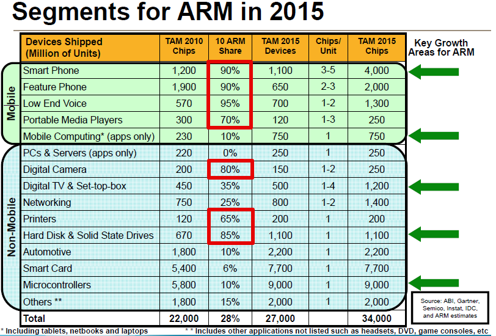
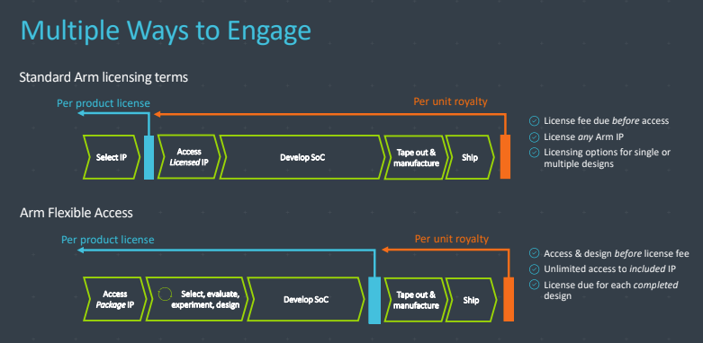
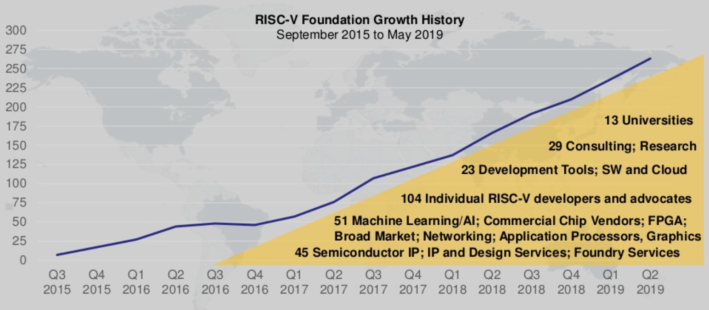

## What is ISA?

### Contract between software and hardware.

## What is RISC?

### Reduced instruction set computer

-   Small set of simple/general instructions + load/store architecture
    -   Optimize hardware to be simple and faster
    -   Software-centric design: rely on compiler + software

| **CISC**                                                     | **RISC**                                                     |
| ------------------------------------------------------------ | ------------------------------------------------------------ |
| Emphasis on hardware                                         | Emphasis on software                                         |
| Includes multi-clock complex instructions                    | Single-clock, reduced instruction only                       |
| Memory-to-memory: "LOAD" and "STORE" incorporated in instructions | Register to register: "LOAD" and "STORE" are independent instructions |
| Small code sizes, high cycles per second                     | Low cycles per second, large code sizes                      |
| Transistors used for storing complex instructions            | Spends more transistors on memory registers                  |

-   E.g. Alpha (DEC), SPARC (SUN), MIPS (now Wave), Power (IBM), ARM

## What is RISC?

-   John Hennessy & David Patterson
    -   Authers of computer architecture bible "Computer Architecture: A Quantitative Approach" (for graduates)
    -   Also "Computer Organization and Design" (for undergraduates)
    -   Turing Award 2017

## Most popular RISC ISA: ARM

background-image: url(../image/money.jpg)

### But also very expensive!

## ARM's business model: IP licensing

### ARM's IP eco-system: CPU-centric custom-SoC IP

CPU (Application/Real-time/eMbedded), GPU, DSP, fabric, cache, ISP, debug, etc.

### License fee + royalty

| IP                          | Royalty (% of chip cost) |
| --------------------------- | ------------------------ |
| ARM7/9/11                   | 1.0% - 1.5%              |
| ARM Cortex A-series         | 1.5% - 2.0%              |
| ARMv8 Based Cortex A-series | 2.0% and above           |
| Mali GPU                    | 0.75% - 1.25% adder      |
| Physical IP Package (POP)   | 0.5% adder               |

&nbsp;

### Architecture license

- Do you want to modify the RTL code?
    - Custom instruction; differentiation
- This license that allows you to implement your own ARM core. 10+ Millions?

## ARM's reaction to RISC-V: Flexible Access

## RISC-V / open source

### Free and open !
- No fee to use or modify
- Commercial usage
    - Don't need to open your modification or implementation

### Open source hardware

## RISC-V / fundation

### http://www.riscv.org

## RISC-V / fundation

[Full list of members](https://riscv.org/membership/?action=viewlistings)

## RISC-V / ISA

### What is defined and not defined in RISC-V ISA

#### Defined

-   Instruction set(s)
-   Architecture states
    -   GPR (general purpose register) + PC
-   CSR (control status register)
-   ABI (application binary interface)
    -   GPR convention
    -   Function/system call convention
-   Exception and interrupt
-   Debug architecture

#### Not-defined

-   Micro-architecture related details
-   Implementation dependent details
-   Even micro-architecture and implementation related instructions
    -   Maybe in the future?

## History / UC Berkeley

### 2010 at UC Berkeley BAR

UC Berkeley Architecture Research in Berkeley EECS department

- Birth place of RISC (reduced instruction set computer)
- Start as a teaching project
- https://bar.eecs.berkeley.edu

### Two persons: David Patterson & Krste Asanovic

-   David Patterson
    -   Turing Award 2017
    -   Contribution: RISC, RAID
    -   Vice Chair of the Board of the RISC-V Foundation
-   Krste Asanovic
    -   Chairman of the Board of the RISC-V Foundation
    -   IEEE Fellow & ACM Fellow

## History

### One company: SiFive at 2015

- Krste Asanovic (Prof. in UCB, Co-Founder & Chief Architect)
- Yunsup Lee (Former student in UCB BAR, Co-Founder & Chief Technology Officer)
- Andrew Waterman (Former student in UCB BAR, Co-Founder & Chief Engineer)

&nbsp;

&nbsp;

## Nowadays / momentum worldwide

### Support from large companies

### Obviously, that's the reason we are here.

## Ecosystem

- Different from traditional architecture that's owned/maintained by **one company**.
- It's more like Linux, owned by **a fundation**, maintained by **a community**.

### Commitee and Work groups

-   Technical committee
    -   Base ISA
    -   Different extensions: BJPV...
    -   Fromal/debug/fast interrupt/memory model/...
-   Program committee (workshops)
    -   Chennai / Shanghai
-   Marketing committee

**Technical committee is open to everyone. Most of them have weekly meeting.**

## Ecosystem

### Workshop & summit

Recent events: 

-   RISC-V Summit
    -   2019/12/10-12 in San Jose, CA, US

## Ecosystem / software

### Compiler

-   GNU toolchain (more developed)
    -   GCC, GDB, OpenOCD
-   LLVM (more promising)
    -   Code optimization
    -   Auto vecterization

### OS

-   Linux: Fedora, Debian
-   RTOS: FreeRTOS, Zephyr OS

### Simulator

-   SPIKE: golden ISA simulator
    -   Only for RISC-V
-   QEMU: full-system simulator
    -   Used for software stack development

### Debugger

-   GDB + OpenOCD
-   Lauterbach
-   Segger
-   UltraSoC

## Ecosystem / hardware

### Open source hardware

- RocketChip
    - The very first one from UCB
    - Not only a CPU but an SoC generator
    - Based on Chisel
    - Now maintained by CHIPS Alliance
- LowRISC
    - UK based company
    - Early adopter
- BOOMv2
     - Student project in UCB (out-of-order RISC-V)
     - Now maintained by Esperanto

- PULP (https://pulp-platform.org/)
    - From ETH Zurich University (Switzerland)
    - Also a family of cores and full SoC system
    - Based on SystemVerilog
- Swerv
     - WesternDigital in-house RISC-V CPU

## Ecosystem / hardware

### Commercial

- SiFive
    - A family of CPUs: 2/3/5/7 series
- Andes
    - A Taiwan CPU company
- Codasip
    - Start from Czech Republic
- Esperanto
    - High-performance cores for AI application
- UltraSoC
    - Debug solution provider

## Ecosystem / hardware

### Others
- Google
- Microsoft
- Rambus
- Facebook
- ...

## Ecosystem / CHIPS alliance

### A project hosted by "the Linux Foundation"

### Difference vs RISC-V Foundation
- RISC-V is for ISA, not implementation
- CHIPS alliance hosts implementation around RISC-V

.footnote[Note: all bay area companies]

https://github.com/chipsalliance

### Open source design

- Chisel + FIRRTL
    - Agile design language and middleware
- FuseSoC
    - Package (library) manager for hardware design

### Open source toolchain

- Verilator
    - Translate SV RTL to C++, then compile and simulate
    - Open source choice besides VCS(S)/Questa(M)/Xcelium(C)
- Cocotb
    - Write testbench in Python
    - https://github.com/chipsalliance/tools-cocotb-verilator-build

### Open source IPs

- Rocket Chip
    - RISC-V CPU generator from Berkeley/SiFive; written in Chisel
- SweRV
    - RISC-V CPU from Western Digital; written in SV
- OmniXtend
    - Network based on TileLink; written in SV?

## Ecosystem / OpenHW group

### Another RISC-V oriented open hardware group

-   Similar to CHIPS alliance

### Open source RISC-V cores

- PULP series CPU cores from ETH Zurich
    - Based on SystemVerilog

### Comercial SoC based on PULP cores

- GreenWaves: multi-core RISC-V SoC for IoT applications
- NXP: BLE controller on RISC-V

### Commercial toolchain

- Metrics: cloud-based simulator
- Imperas: ISS (instruction set simulator)
- OneSpin: formal verification

## Ecosystem / RISC-V in China

### 中国RISC-V产业联盟
CRVIC (China RISC-V Industry Consortium)

- 上海市 + 企业
- Verisilicon

### 中国开放指令生态(RISC-V)联盟
CRVA (China RISC-V Alliance)

- 中科院计算所
- 倪光南

## Resources

### RISC-V Github (https://github.com/riscv)

-   Specification
-   Toolchain
-   Linux

### Discussion groups on Google Groups

-   [Hardware Developer](https://groups.google.com/a/groups.riscv.org/forum/#!forum/hw-dev)
-   [Software Developer](https://groups.google.com/a/groups.riscv.org/forum/#!forum/sw-dev)
-   [ISA Developer](https://groups.google.com/a/groups.riscv.org/forum/#!forum/isa-dev)
-   [Debug](https://groups.google.com/a/groups.riscv.org/forum/#!forum/debug)

## Summary

### Open ISA

- Free to use/modify
- Open source (like Linux)
    - Owned by RISC-V foundation
    - Maintained by community
    - Tech committees

### History & momentum

- Start from UCB as a student project
- Now widely supported by lots of companies worldwide

### Ecosystem

- Software
    - Open source
- Hardware
    - Both open source and commercial
- RISC-V in China

