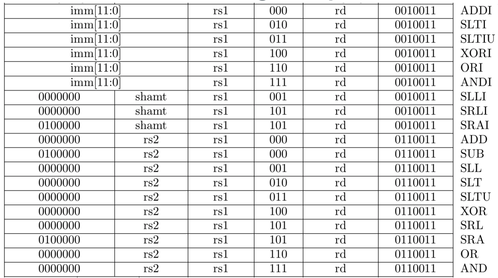
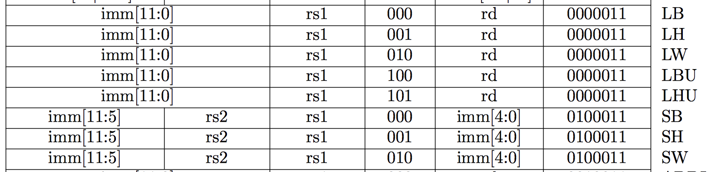
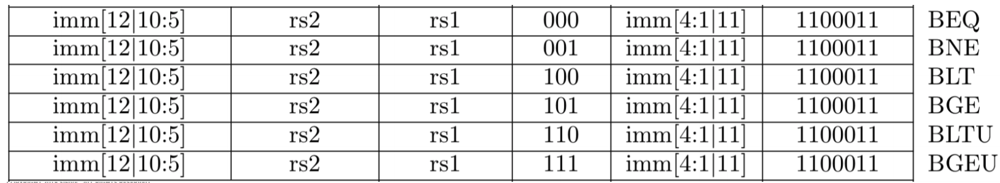
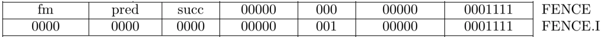
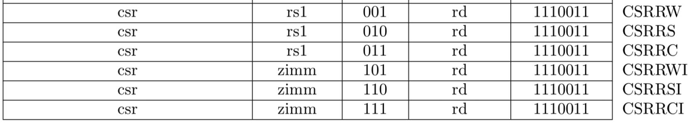
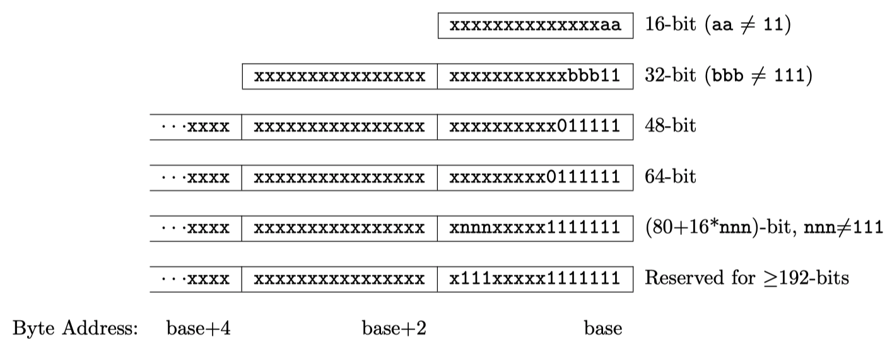
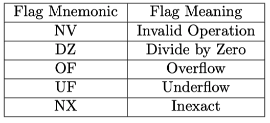
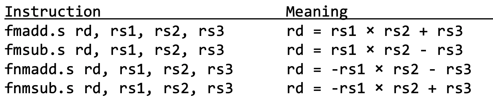
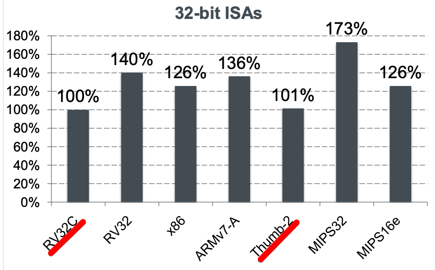

## RISC-V SPEC

https://riscv.org/specifications (official version v1.10 while version v2.0 under ratification)

https://github.com/riscv/riscv-isa-manual (source code)

&nbsp;

### User-level ISA (unpriviledged)
- All the basic instructions, and extensions
- Memory model

### Priviledged ISA

- Priviledge level: M (machine), H (hypervisor), S (supervisor), U (user)
- CSR (control status register)
- Virtual-memory system

### Debug & Trace


## First impression: ISA subsets

### RISC-V is a family of ISAs

Divided into several subsets: I, M, A, F, D, C, ...

-   *Domain-specific architecture* (by David Patterson)
    -   The ending of Moore's Law => domain-specific architecture is the future of computing
    -   Too costy to be "general purpose" anymore
        -   Too many new domains
        -   Not enough transistors or power to be general purpose
    -   E.g. TPU-like xPU for AI computing

- RISC-V ISA's approach
    - Different domain-specific implementations can select **subsets suitable** for its own domain
    - Only I (base) is mandatory
    - Can be extensible in the future

.footnote[Ref: [A Domain-Specific Architecture for Deep Neural Networks](https://cacm.acm.org/magazines/2018/9/230571-a-domain-specific-architecture-for-deep-neural-networks/fulltext)]


## First impression: ISA subsets

My deepest impression of RISC-V ISA

-   Extensible
-   Hardware-friendly


## Why RISC-V ISA is highly extensible?

Instruction space is divided into 3 disjoint categories
-   Standard: defined with specification
-   Reserved: for future extensions
-   Custom: implementation can have its own custom instructions

Standard subsets as of now
-   `I`: base integer computational instructions, integer load/store, control-flow
-   `M`: integer multiplication and division extension
-   `A`: atomic instruction extension, for inter-process synchronization
-   `F/D`: single/double-precision floating-point extension
-   `C`: 16-bit compressed instruction extension (higher code density)

> `IMAFD` = `G`, so `RV64GC` = `RV64IMAFDC`


## RISC-V's approach of extension

&nbsp;

### Extension

Keep the base the same, while add new extensions over time

&nbsp;

### Reserved

Add extension very carefully, sometimes seems too slow

&nbsp;

### Custom

Keep custom instruction category open, and the software flow to add custom instruction easy

&nbsp;


## 32-bit or 64-bit?

### Exclusive 32-bit and 64-bit ISA
-   Explicitly separate 32-bit and 64-bit ISA
    -   Unlike ARMv8-A which has AArch32 and AArch64 both compatible
    -   For hardware simplicity
        -   Optimize for its needs without requiring to support all the operations needed for other base ISA
-   But introduced some confusion, and issues for virtualization
    -   In 32-bit version, `ADD` means 32-bit add, but in 64-bit the same instruction means 64-bit add
    -   And 64-bit version has `ADDW` that support 32-bit operations

### Instruction length is orthogonal
-   32-bit for normal instructions
-   16-bit for compressed extension
-   48-bit or even longer reserved for future


## RISC-V Terminology

### Hart = hardware thread

Hart is a very important concept in RISC-V

-   One RISC-V core might contain multiple harts (hardware threads) to support multithreading
-   All ISA concepts are based on hart
    -   Each hart has its own PC, GPR, CSR, interrupt, exception, and etc.
    -   But they may share the same front-end (instruction fetch and decoding), or shared ALU, LSU or accelerators


### Memory

-   Size unit
    -   Word = 32-bit
    -   Halfword = 16-bit
    -   Doubleword = 64-bit
    -   Quadword = 128-bit
-   Implicit and explicit access
    -   Implicit memory access = instruction fetch
    -   Explicit memory access = load/store
    -   Memory access ordering between implicit and explicit access: `FENCE.I`
        -   E.g. self-modified code

-   Weak Memory Ordering (RVWMO)
    -   This is the weakest model allowed
    -   Implementation can adopt stronger model of Total Store Ordering
-   Little-endian
    -   Hardware-friendly
    -   Fixed, not configurable like MIPS


### Exceptions, traps and interrupts

-   **Exception**: unusual conditions happened in current RISC-V hart
    -   E.g. illegal instructions, divide by zero, page fault
    -   Precise exception
        - All instruction before the exception has to commit
        - All instruction after the exception cannot commit
-   **Interrupt**: external asynchronous event asking for RISC-V hart's attention
    -   E.g. DMA is done, keyboard input
    -   Interrupt doesn't need to be precise
&nbsp;
-   **Trap**: the transfer of control to a trap handler caused by exception or interrupt
    -   Contained / requested / invisible / fatal


## [Tips] How to download and compile latest ISA SPEC

```shell
git clone https://github.com/riscv/riscv-isa-manual.git
cd riscv-isa-manual

git tag -l
git checkout draft-20190521-21c6a14 # select the latest tag
make
```

### Pre-requisition: install LaTeX in Ubuntu

```shell
apt-get install texlive-full
```


## RV32I: base integer instruction set

### Let's start from the **base**, and talk about extensions later.


## RV32I / GPR (general purpose registers)

-   32 GPR: x0 to x31
    -   PC is not one of them
-   X0 is hardwared to 0
    -   Writing to it doesn't take any effect
    -   Very useful
        -   `NOP` is implemented as `ADDI x0, x0, 0`
-   GPR + PC = architectural state
-   Width: depends on 32-bit or 64-bit system
    -   `XLEN` represents data width
        -   E.g. 32-bit system `XLEN=32`, while 64-bit system `XLEN=64`

.footnote[Correspondingly, `ILEN` represents instruction width. Currently, only `ILEN=32` and `ILEN=16` are defined.]


## RV32I / instruction formats

-   `ILEN = 32` instruction width = 32-bit
-   4 base formats + 2 immediate-encoding variants
-   **Very hardware friendly**
    -   Register specifier always in the same place
    -   `opcode` are always in the same place
        -   Also considered instruction frequency (more common, simpler opcode, good for power)
    -   `funct3` / `funct7` are in the same place
    -   Immediate is encoded considering hardware muxing overhead

.center[]


## RV32I / arithmetic and logical operations

-   Add, sub, and, or, shift, comparison
-   No conditional operation, no implicit flag registers
    -   Comparison always write to `rd`, next instruction check its value and decide what do next
    -   Worse code density, but much easier hardware design

.center[]

> I really don't think it's a good idea. More software cost, more power


## RV32I / memory access instruction

-   Load: `rd := @(rs1 + imm)`
-   Store: `@(rs1 + imm) := rs2`
-   Sign extension when load
    -   By default, extend sign bit to `XLEN`
    -   `U` (unsigned), so do zero-extend

-   Byte selection
    -   `B` = byte = 8-bit
    -   `H` = halfword = 16-bit
    -   `W` = word = 32-bit
    -   `D` = double-word = 64-bit
.center[]


## RV32I / memory access instruction

### Misalignment

-   E.g. if `LD` doesn't align to 64-bit boundary, it's a misalignment
-   Whether misalignment will trigger an exception, it depends on the implementation
    -   To simplify hardware design
    -   Also support special application, like SIMD


## RV32I / addressing

-   Absolute address: `LUI` (load upper immediate)

```assembly
lui     t0, 0x12345     # t0 = 0x12345000
lw      t0, 0x678(t0)   # t0 = MEM_READ(0x12345678)
```

-   PC-relative address: `AUIPC` (add upper immediate to PC)

```assembly
auipc   t0, 0x12345     # t0 = PC + 0x12345000
lw      t0, 0x678(t0)   # t0 = MEM_READ(0x12345678)
```

.center[]

>   Most of the time we use `AUIPC` because the program should be able to load to any address base, and addressing inside is relative to `PC`.


## RV32I / jump (unconditional)

-   `JAL` (jump and link): use immediate number as jump offset (+/1 1MiB)
    -   `rd := PC + 4; PC := PC + imm`
    -   Function call: `rd = x1 = ra`
-   `JALR` (jump and link register): use register and immediate number as jump target address
    -   `rd := PC + 4; PC := rs1 + imm`
    -   Return from a function call: `rd = x0, rs1 = x1`
    -   Indirect call: `rd = x1 = ra` to further away address

.center[]


## RV32I / branch (conditional)

-   Compare `rs1` and `rs2`
    -   if true, `PC := PC + imm`
    -   else `PC := PC + 4`
-   `EQ`: equal; `NE`: non-equal
-   `LT`: less than; `GE`: greater than
-   `U`: unsigned comparison

.center[]


## RV32I / fence

-   `FENCE`: for memory ordering
    -   Guarantee all memory access before this instruction has already been committed to its destination.
        -   E.g. write data structure to external DRAM, then notify PCI-Express DMA to send it out through its link
            -   Need to add `FENCE` after writing DRAM
-   `FENCE.I`: for self-modifying code
    -   Force all memory write to commit first, then invalidate all the I-Cache entries, before resume instruction fetch.
-   Will be discussed in later session regarding to "Memory Model"

.center[]


## RV32I / CSR access

-   `CSRRW`: read/write CSR, exchange `rs1` and `rd`
-   `CSRRS`: read then set bits, use `rs1` as bit mask, old value written into `rd`
-   `CSRRC`: read then clear bits, use `rs1` as bit mask, old value written in to `rd`
-   `CSRRWI/CSRRSI/CSRRCI`: meaning are the same, just use immediate as bit mask
-   **Notice**: all CSR access instruction is atomic instruction, which means read-modify-write will happen in one cycle

.center[]


## RV32I / system call and breakpoints

-   `ECALL`: trap into system call in higher privilege mode, raise *environment call* exception
    -   Normally the arguments are passed with memory, pointer is saved in `mscratch` register
-   `EBREAK`: trap into debug mode, raise *breakpoint* exception

-   More details in later session regarding to "system call" and "debug mode"

.center[]


## [Extention] Software breakpoint and `EBREAK`

-   Breakpoint is always used for software debug.
-   `EBREAK` instruction will trigger a breakpoint exception, and trap into trap handler. Then kernel will decided what to do after that.

### Software breakpoint

-   When software breakpoint is used, debugger will replace the instruction at breakpoint to be `EBREAK`
-   Hardware breakpoint: don't need to modify the code
    -   Limited number


### Example C code

```c
#include <stdio.h>

int main(void) {
    printf("before breakpoint\n");

    asm volatile
        (
         "ebreak\n\t"
         :
         :
        );

    printf("after breakpoint\n");
    return 0;
}
```


### PK: print out breakpoint info and return.

```assembly
> spike -m16 pk bp_norvc.elf
bbl loader
before breakpoint
z  0000000000000000 ra 00000000000101c0 sp 0000000000fd9b40 gp 0000000000013f58
tp 0000000000000000 t0 8800000503e80001 t1 0000000000000007 t2 000021900003000e
s0 0000000000fd9b50 s1 0000000000000000 a0 000000000000000a a1 0000000000014770
a2 0000000000000012 a3 0000000000000000 a4 0000000000000000 a5 0000000000000001
a6 000000000000000a a7 0000000000000040 s2 0000000000000000 s3 0000000000000000
s4 0000000000000000 s5 0000000000000000 s6 0000000000000000 s7 0000000000000000
s8 0000000000000000 s9 0000000000000000 sA 0000000000000000 sB 0000000000000000
t3 0000000000000000 t4 000000005d378e40 t5 0000000000000000 t6 0000000000000000
pc 00000000000101c0 va 00000000000101c0 insn       ffffffff sr 8000000200046020
*Breakpoint!
after breakpoint
```


## That's it!

### RV32I is a complete instruction set


## Variants

### Data width variants

-   RV64I: 64-bit data/address variant
    -   `XLEN = 64` general purpose registers
    -   `D` (double-word) load/store
        -   E.g. `LD a0, 0(sp)`
    -   `W` (word) arithmetic instructions that works on lower 32-bit of the registers
        -   E.g. `ADDIW a1, a0, 1`
-   RV128I: 128-bit data/address variant

>   Because they are exclusive instruction sets, need to tell compiler this information


## Variants

### Instruction length variants (as ISA extension)

-   RV32C (compressed): 16-bit instruction extension
-   Future: SIMD, VLIW, graphics, …

.center[]


## Variants

### ISA extensions

-   `M`: integer multiplication and division
-   `A`: atomic instruction
-   `F`: single-precision floating-point
-   `D`: double-precision floating-point
-   `C`: compressed instruction

These are the most used ISA extensions. `IMAFD = G`

Other popular working-in-progress extensions
-   `N`: user-level interrupts
-   `V`: vector operations
-   `P`: packed-SIMD instructions
-   ...


## RV32M: multiply & divide

| Instruction    | Meaning                                            |
| -------------- |--------------------------------------------------- |
| `mul`          | Multiplication, store low 32-bit to `rd`           |
| `mulh`         | Signed multiplication, store high 32-bit to `rd`   |
| `mulhu`        | Unsigned multiplication, store high 32-bit to `rd` |
| `mulhsu`       | Signed x unsigned, store high 32-bit to `rd`       |
| `div` / `divu` | `rd = rs1 / rs2`                                   |
| `rem` / `remu` | `rd = rs1 % rs2`                                   |

-   Separate instruction to get higher and lower parts of multiplication result.
    -   But if do `mulh*` followed by `mul` directly, hardware does not need to redo the multiplication again.
-   The same thing applies to division results also.
-   Divide by zero
    -   There is NO divide-by-zero exception
    -   Software need to explicitly check the divisor

> I also don't agree with this approach


## RV32A: atomic memory operation

-   Atomic memory operation = read-modify-write
-   In RISC-V, it support 2 types of atomic operation model
    -   Read-modify-write instruction
    -   Load-reserve / store-conditional

### AMO (read-modify-write)

-   Directly send `amo*` instructions down to the memory hierarchy
    -   Easy and intuitive
    -   Needs both network fabric, target device (either cache or peripherals) support atomic memory operation
    -   Cannot do too complicated operations


### LR/SC (load-reserve / store-conditional)

-	Split read-modify-write into 3 steps
    -	Load data and acquire reservation on target address
    -	Compute new value
    -	Store new value, only if reservation still held
-	Store may fail, when reservation is not acquired or not kept, so it will need retry
-	Example: use LR/SC to decrement a variable until it's zero

```assembly
retry:
  lr.w t0, (a0)
  beqz t0, done
  addi t0, t0, -1
  sc.w t1, t0, (a0)
  bnez t1, retry
done:
```

-   Pros: easy to implement, can support complicated operations; cons: low performance


## RV32E: embedded extension

-   Reduce 32 GPRs to 16 GPRs
    -   For a super small implementation, 32 GPRs can take up 25% area

>   Rarely see any implementaions


## Floating-point extensions

-   `F/D` extensions
    -   `F` = single-precision floating-point
    -   `D` = double-precision floating-point
-   Floating-point specific registers: f0 - f15
    -   If only support F, register width is 32-bit. `FLEN = 32`
    -   If support both F & D, all registers are 64-bit. `FLEN = 64`
-   Floating-point CSR: `fcsr = {frm, fflags}`
    -	Rounding mode register (dynamic)
    -	Aggregated exception flags
        -   However hardware will not trigger exceptions


## Floating-point / load & store instructions

-   Same instruction format as integer load/store

| Instruction                                 | Meaning                                                      |
| ------------------------------------------- | ------------------------------------------------------------ |
| `flw frd, imm(rs1)` & `fld frd, imm(rs1)`   | Load single/double-precision floating-point from address `imm(rs1)` into `frd` |
| `fsw frs2, imm(rs1)` & `fsd frs2, imm(rs1)` | Store single/double-precision floating-point from `frs2`to address `imm(rs1)` |

.footnote[`f*` = float-poing register, e.g. `frd` is floating-point destination register]


## Floating-point / conversion instructions

-   Rounding mode
    -   Static rounding mode: defined in instruction `RM` field
    -   Dynamic rounding mode: instruction `RM` field is `DYN` then use `frm` (rounding mode register)


-   Instructions
    -   `FCVT.*.*` : convert between floating-point registers and GPR (as integer value)
    -   `FMV.*.*`: directly move between floating-point registers and GPR
    -   `FSGNJ`: sign-injection provides ABS and NEG operation on floating-point


## Floating-point / arithmetic instructions

-   Floating-point exception
    -   Will no generate trap on IEEE-754 exceptions. Need to read `fflags` fields in `fcsr`
    -   No NaN-payload propagation (NaN = not a number)
    -   Exception flag in `fcsr`




## Floating-point / arithmetic instructions

-   Floating-point arithmetic operation examples


-   MAC: multiplication and accumulation (in GCC, it's called FMA, fused multiplication/addition)




## Floating-point / classification instructions

-   `FCLASS`


## Floating-point / implementations

### Hardware implementation: Berkeley HardFloat

-   Written in Chisel
-   https://github.com/ucb-bar/berkeley-hardfloat

### Berkeley SoftFloat

-   Conforms to IEEE standard
-   Used in SPIKE simulator, and HardFloat's test suite as golden standard
-   http://www.jhauser.us/arithmetic/SoftFloat.html


## R32C: compressed instruction extension

### Requirements from the market: code density

-   Code density means less on-chip memory
    -   Super important for embedded systems
-   Higher code density means lower I-Cache miss rate and lower instruction fetch power

### 16-bit instruction

32-bit instruction encoding is not very dense, so reduce it to 16-bit

-   ARM has Thumb-2
-   RISC-V has C-extension


## RV32C / how?

### Observations

-   A handful of opcodes are very popular
    -   `addi` & `lw` & `sw` consist more than 50% of the instructions
-   GPR access locality: 2/3 of the time are referring to 1/4 of the registers

### Ideas

-   Use 16-bit representation of most popular instructions
-   Limit register access to only x8-x15 to reduce register index size


## RV32C / one big issue

### Comparing to Thumb-2

-   No `ldm` (load-multiple) / `stm` (store-multiple)
    -   Use shared prologue/epilogue. More used, more code saved.

```assembly
__riscv_save_1:		# shared prologue
addi sp,sp,-16
sw s0,8(sp)
sw ra,12(sp)
jr t0
__riscv_restore_1: 	# shared epilogue
lw s0,8(sp)
lw ra,12(sp)
addi sp,sp,16
ret
function:
jal t0,__riscv_save_1
# ...
jal x0,__riscv_restore_1
```

>   Personal experience: not very well supported by GCC compiler


## RV32C / result

### Benchmark: SPEC CPU2006



>   Personal experience: Thumb-2 (ADS) is currently 20% smaller than RV32C (GCC). In the compiler territory, RISC-V still have a long way to improve.

.footnote[the benchmark should use CoreMark, which is specially design for embedded process use case]


## Other popular extension


### "V": vector operations

-   Popular because of AI applications
-   Difficult because of compiler
    -   How to vectorize for loops
    -   Current solution is LLVM
-   Current version 0.7
-   https://github.com/riscv/riscv-v-spec

### "B": bit manipulation

-   Useful for specific domains such as communication that need to deal with packed data structures
-   Current version 0.0
-   https://github.com/riscv/riscv-bitmanip

### "P": packed-SIMD fixed-point operations

-   Parallelize fixed-point operations
-   Current version 0.2


## Summary

.row[
### Extensible
- Base + extensions
- Custom instruction
- Domain-specific arch
- Still growing fast

### Hardware-friendly
- Simple instruction set
- Designed to make hardware simple
- Micro-architecture freedom
- Compiler still have room to improve

.row[
### It's a good time to start learning about RISC-V!
- Still simple enough to start with
- More committment from big players


