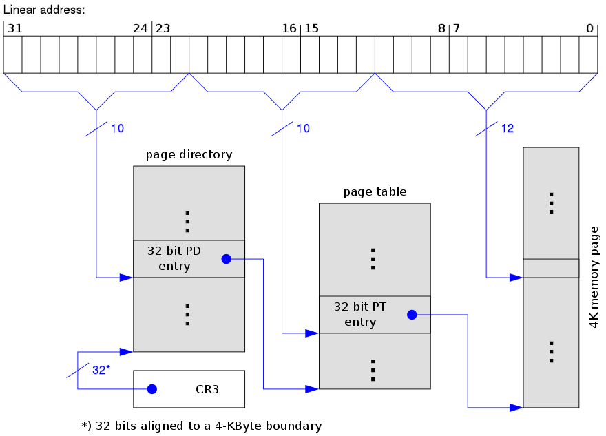
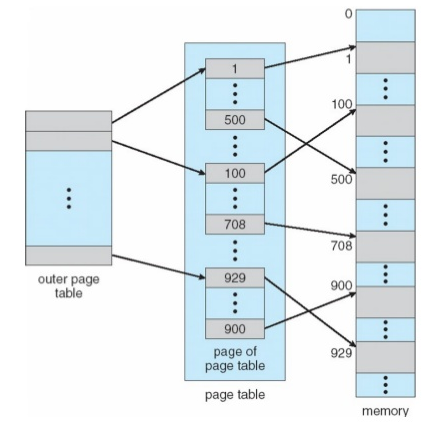
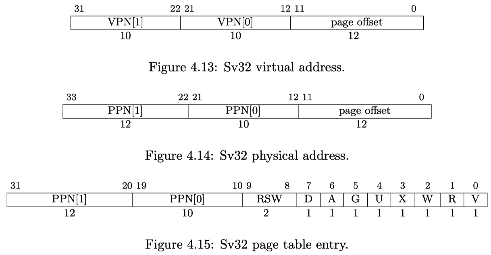
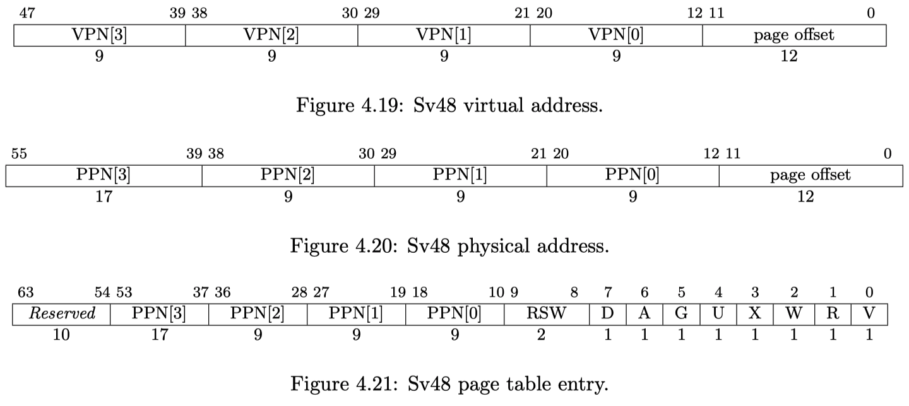
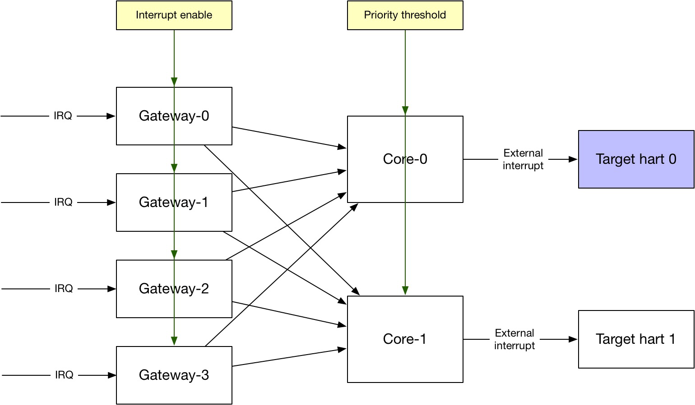

## Privileged architecture

### Purpose of privileged architecture

-   To manage and protect shared resources
    -   Memory, IO devices, even cores

-   Also needs to decouple implementation details
    -   Handle unimplemented operations: software emulation
    -   Handle async events (interrupts): IO, timer, software
    -   Hypervisor support: 2-level address translation

### Therefore, we have

-   4 privilege modes: U, S, H, M
-   PMP/PMA (physical memory protection/attributes)
-   Virtual memory
-   Interrupts and exceptions
-   And a bunch of CSRs to serve these functionality

## Privileged architecture / software stack layers

### 4 different kinds of platforms

| Platforms                                                   | Modes   | Trust       | Memory protection          |
| ----------------------------------------------------------- | ------- | ----------- | -------------------------- |
| Embedded w/o protection (most MCUs)                         | M       | All         | Non                        |
| Embedded w/ protection (RTOS scenario)                      | M+U     | Application | Physical memory protection |
| OS capable (Linux, and etc.)                                | M+S+U   | OS          | Virtual memory             |
| Cloud OS capable (multiple OS running on the same hardware) | M+H+S+U | Hypervisor  | 2 level of virtual memory  |

## Privileged architecture / software stack layers

|                           | Hardware                  | Interface                    |
| ------------------------- | ------------------------- | ---------------------------- |
| Bare-metal application    | AEE (application exe env) | ABI (application binary i/f) |
| Operation system          | SEE (supervisor exe env)  | SBI (system binary i/f)      |
| Hypervisor w/ mutliple OS | HEE (hypervisor exe env)  | HBI (hypervisor binary i/f)  |

&nbsp;

### The interface is `ECALL` instruction

Generates ECALL exception and traps into supporting execution enviroment

## Privilege modes

### 4 privilege modes (from low to high)

-   U: user mode for application
-   S: supervisor mode for operating system
-   H: hypervisor mode for virtualization
-   M: machine mode

Debug (non-functional mode) is slightly higher than machine model, but need physical debugger connected and enabled.

-   Each privileged mode has its own CSRs and instructions
    -   CSRs can only be accessed by higher/equal levels of modes
    -   Access permission violation will throw exception
-   Mode specific instructions
    -   `ECALL`: transition between software layer, and privilege modes
    -   `xRET`: return to previous layer and mode
        -   `MRET`, `SRET` 
    -   `SFENCE.VMA`: supervisor mode only. Clear TLB after change the page table in memory
    -   `WFI`: machine mode only. Stall current hart until an interrupt, super useful for low power application

## Privilege modes / M (machine)

-   The highest / only-mandatory privilege mode
-   The level that can directly access hardware, right after reset

### Machine mode CSRs

-   `misa`: because RISC-V is a family of ISAs, every implementation has its own supported ISA subsets. `misa` contains the ISA subsets current hart supports
-   `mstatus`: an aggregation of operating states
    -   Global interrupt enable, and interrupt stack. And others ...
-   And a bunch of CSRs for trap handling
    -   `mtvec`, `medeleg` and `mideleg`, `mip` and `mie`, `mtime` and `mtimecmp`, `mscratch` and `mtval`, `mepc` and `mcause`
    -   More details will be discussed in later section.

.footnote[Note: Other privilege modes have similar CSRs, some of them are just a shadow of M-mode CSRs which are read-only in lower privilege modes.]

## Virtual memory

### What?

- **Abstraction** of actual memory resource to create the **illusion of owning** a dedicated/large memory for each application/process.

### Why?
-   Decouple: e.g. 2GiB physical memory shared by OS and hundreds of processes.
-   Security: e.g. isolate memories from process to process

### How?

-   Address translation by MMU (memory management unit)
    -   Obviously cannot do 1-to-1 translation, too many entries
-   Paged virtual memory
    -   Divide virtual address space into pages, e.g. 4KiB
    -   Still cannot do 1-to-1 translation, too many entries (4GiB/4KiB = 1Mi)
-   Hierarchical page tables
    -   Example of 3-level page tables as shown

## Virtual memory / RISC-V

-   Finest granularity of page size if 4KiB
    -   Last level of page table
-   PTE (page-table entry) contains
    -   Physical address
    -   Permission bits
    -   Page status (accessed / dirty)
-   Hardware PTW (page-table walker)
    -   PTW is mechanism to go through the page tables to find target virtual address's physical address
-   Software TLB (translation lookaside buffer) refill
    -   TLB is a cache of PTE close to pipeline for faster translation
        -   Otherwise, every memory access becomes at least 4 memory accesses

-   Support ASID (address space ID)
    -   Reduce context switch cost when different processes running on the same hart
-   Multi-level page tables
    -   2-level for SV32; 3-level for SV64
-   Super-page: stop before reaching to the last level leaf
    -   Much larger size of page size
    -   Less missing rate in TLB

### TLB flush instruction `SFENCE.VMA`

-   When page tables are updated in memory, need to flush current TLB entries for update
-   But only affects local hart, so if to sync with other hards, IPI (inter-process interrupt) is needed

## Virtual memory / address translation

### Look up TLB

-   TLB is just like cache. Its miss will trigger page table walker
    -   Small system use full-associated design with less entries
    -   Large system use way-associated design with more entries

### Page table walker

-   Hardware PTW: simple FSM that reads memory
-   Software PTW: more latency/power
-   Page fault exception: page is in external storage, or not allocated

### Software MMU

-   Allocate new page, or read in page from external storage
-   Page replacement if physical memory is full (next slide)

## Virtual memory / page replacement

-   Physical memory is not unlimited, when it's full, old page needs to be swapped out to external storage
-   In RISC-V page replacement is managed by software
    -   When a page is used but its not currently in physical memory, raise "page fault exception" to involve software
    -   Hardware support is the `accessed` and `dirty` bits in each PTE (page table entry)
    -   Recently non-accessed pages will be freed
    -   Dirty pages will be written out to external storage

## Virtual memory / protection

-   Every PTE has 3 bits of permission field

## Virtual memory / SV32

## Virtual memory / SV39

## Virtual memory / SV48

## PMP (physical memory protection)

### Why?

-   If without full featured OS, virtual memory is not efficient.
-   Embedded systems, with RTOS (real-time OS), still need memory protection to isolate user application from accessing kernel space

### PMP: add R/W/X permissions to PMP regions

-   By default, S/U mode doesn't have permission
-   Num of regions is up to 16, aligned to 2^N
-   Higher priority than virtual memory protection
    -   PMP checks happen after VMP (virtual memory protection) checks
    -   Useful for untrusted S-mode

## PMA (physical memory attributes)

### Attributes of physical memory regions

-   **Cacheable or non-cacheable**
-   Ordering allowed
-   Atomic access allowed
-   Mode allowed
-   Access widths allowed
-   Alignment restriction
-   ...

Attributes can be programmable

.footnote[Note: RocketChip doesn't support PMA]

## Interrupt and exception

### Difference?

- **Interrupt is async, exception is sync**
    - Sync means tied to specific instruction execution

### Interrupt types

-   Software
    -   Initiator is another hart/processor
-   Timer
    -   For timely scheduled tasks
-   External
    -   Peripheral devices, e.g. DMA

### Exception types

-   Instruction address misaligned
-   Instruction access fault
-   Illegal instruction
-   Breakpoint
-   Load address misaligned
-   Load access fault
-   Store/AMO address misaligned
-   Store/AMO access fault
-   Environment call from U/S/M-mode
-   Instruction page fault
-   Load page fault
-   Store/AMO page fault

## Interrupt and exceptions / exception

### Misalignment

- Whether misaligned load/store will trigger exception depends on implemenation.
- Instruction misalignment

### Enviroment call

- `ECALL` triggers an exception to change privilege modes

## Interrupt and exceptions / related CSRs

### Where to trap

-   `xTVEC`: entrance address of trap
    -   2 modes: direct (BASE) or vectored (trap to BASE+4xcause)

### Mode to trap into

-   `xI/EDELEG`: trap deligation registers
    -   By default, trap into machine mode, but use deligation registers, other modes can be delegated for certain types of trap
    -   User-level interrupt: improve interrupt handler's turn-around-time

### Reason to trap

-   `xCAUSE`: the cause of trap
-   `xTVAL`: trap value written by hardware
    -   Contain more information about the exception

### How to return from trap

-   `xEPC`:PC before trap handler (in order to resume after trap handler)
-   `xSTATUS`: it holds the previous privilege mode `xPP` and global previous interrupt enable  `xPIE`

### Interrupt enable

-   `xSTATUS`: global interrupt enable 
-   `xIE`: interrupt enable for each modes and types
-   Exception cannot be disabled

## Interrupt and exceptions / interrupt controller

### PLIC (platform level interrupt controller)

- External interrupt aggregator

### CLINT (core local interruptor)

- Provide timer and software interrupt memory-mapped CSRs

Both PLIC and CLINT will be covered in later section

## Summary

### Purpose of privileged arch
- Manage resource
- Decouple implementation details

### 4 privilege modes
- U, S, (H), M

### Memory
- Virtual memory
- PMP & PMA

### Exception

- Precise exceptions
- Cause mode changing

### Interrupt

- Non-precise interrupt
- 3 types: external, timer, software
- PLIC (platform-level interrupt controller)

