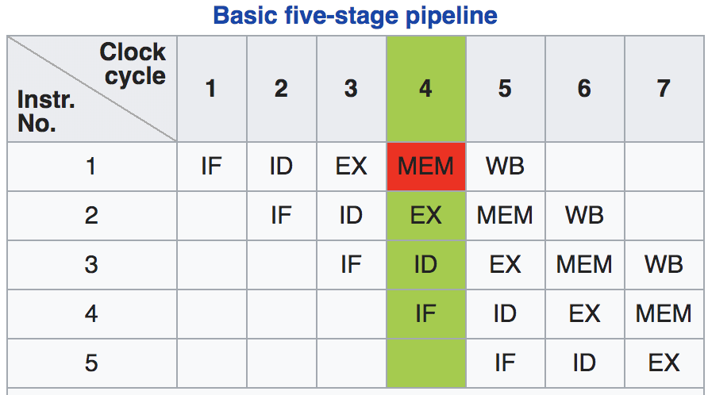
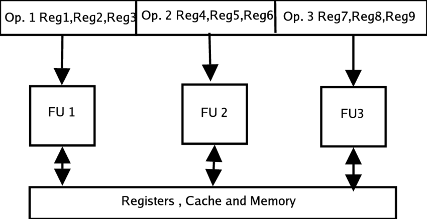

## Computer architecture basics

&nbsp;

### Pipeline  /  Parallelism  /  Cache


Three ultimate mechanisms to imporve performance/power


## Computer architecture basics / pipeline



IF = Instruction Fetch, ID = Instruction Decode, EX = Execute, MEM = Memory access, WB = Register write back).


## Computer architecture basics / pipeline

### @DEMO

Pipeline simulator: https://github.com/mortbopet/Ripes


## Computer architecture basics / pipeline

### Motivation

-   Most of the work **cannot** be done at the same time.
-   To use the logic more efficiently
-   Less work per stage, higher clock frequency

### Brings in problems: hazards

- Data hazard
    - Dependency

```assembly
mv      x1, x2
add     x4, x1, x3
sd      x4, 0(x5)
```

- Control hazard
    - Jump and branch

```assembly
addi    x1, x1, 1
subi    x2, x1, 100
bnez    x2, 0(x3)
```

.co-4[
- Structure hazard
    - Multi-cycle multiplier

```assembly
mul     x1, x2, x3
mul     x4, x5, x6
mul     x7, x8, x9
```


## Computer architecture basics / pipeline


### Other considerations

-   Exception and interrupt
    -   Flush pipeline
-   Atomic operations
-   ...


### Improvements

-   Deeper pipeline
    -   Higher frequence, higher power
    -   Mostly for CISC machines
-   Branch prediction
    -   Reduce branch penalty


&nbsp;

#### Branch prediction

-   BTB (branch target buffer)
    -   Store the target PC
-   BHT (branch history table)
    -   Store taken or non-taken history
-   RAS (return address stack)
    -   Call stack history address

-   **Flush if prediction is wrong. Waste power**


## Computer architecture basics / parallelism

### Parallelism

#### ILP (instruction-level parallelism) & TLP (thread-level parallelism)

-   Multi-issue
-   SMT (simultaneous multi-threading)
-   VLIW (very long instruction word)
-   SIMD (single instruction multiple data)
-   Out-of-order
-   ...


## Computer architecture basics / parallelism

### Multi-issue (a.k.a superscala)

-   Issue multiple instructions parallelly to reuse **CPU resource** 
    -   With minimum extra control logic to reuse execution logic


## Computer Architecture Basics / parallelism

### VLIW (very long instruction word)

-   Compiler defined parallelism to reuse CPU resource
-   Pack mutiple instructions into one long instruction




## Computer architecture basics / parallelism

### SIMD (single instruction multiple data)

-   Vectorization
    -   Graphics & **machine learning**
-   Large register file becomes bottleneck


## Computer architecture basics / parallelism

### OOO (out-of-order)

-   Issue instructions not following the program order to resolve dependencies
-   Register renaming, reorder buffer, etc...
-   Transparent to software

#### Example

```assembly
addi    x1, x1, 1
ld      x2, 0(x1)       # if cache miss, will be slow
add     x3, x3, 4
ld      x4, 0(x3)       # if cache miss, will be slow
mul     x5, x5, x6      # multi-cycle operations
```

-   But these slow operations don't have dependency with each other
    -   Therefore we can issue `mul` while waiting for the first `ld`
    -   But commit in order


## Computer architecture basics / parallelism

### SMT (simultaneous multi-threading)

-   Different from **temporal multi-threading (aka super-threading)**.
-   Different program/thread reuse CPU resource
    -   Usually separated register files and CSRs, but use common execution units, cache and TLB
    -   RISC-V hart (hardware thread)
-   Need compiler/OS's help to explore thread-level parallelism


## Computer architecture basics / cache

### Main memory: DRAM (dynamic random-access memory)


- Dynamic vs. static
    - One-bit = one capacitor + one resistor
        - The capacitor needs periodical rewrites (refresh) to keep its data. So it's called *dynamic*
        - Much smaller in size; volatile (lose power lose data)
- Parallel read/write a whole row
    - Use SRAM as buffer to speed up random access
- Rank: another level of parallelism
    - A set of DRAM chips with the same chip select

- SDRAM (synchronous DRAM)
    - With clock: DDR (double data rate)
- Bandwidth
    - LPDDR4-3200 MT/s * 16-bit/channel * 2-channel = 12.8 GB/s
    - DDR5-6400 MT/s, total 64GB/s
- The access time
    - **~100ns**: too long for modern pipeline

&nbsp;

Hierarchical cache is created to improve the **latency and throughput** for memory access.


## Computer architecture basics / cache

### What is cache?


-   Index and tag
    -   Assuming total memory has 16-entry of data, address is 4-bit. But cache has only 4-entry of data, its address (called index) is 2-bit. Then we need to save the other 2-bit as tag in the cache.


## Computer architecture basics / cache

### Cache types


-   Direct mapped cache
    -   Fixed position given the address
-   Fully associated cache
    -   Cache entry can go anywhere, need to compare every entries to find a match
-   Way associated cache
    -   Given address can go into different ways


## Computer architecture basics / cache

### Problems

-   Cache coherence
    -   Copies of data in the whole system
    -   Read is OK, but write causes coherency problem
-   Self-modification code in Harvard architecture
    -   Need a special instruction to invalidate instruction cache


## RocketChip

### CPU complex generator from UCB

### The very first RISC-V CPU


## RocketChip / core

### Open source. Written in Chisel. Highly configurable!


-   5-stage pipeline
-   In-order single-issue
-   Branch prediction
    -   BTB (branch target buffer)
    -   BHT (branch history table)
    -   RAS (return address stack)
-   MMU (memory management unit)
-   Non-blocking data cache
-   Floating-point unit


## Rocket Chip / generator

### Beyond a CPU core

-   Network fabric + cache + IOs
-   Configuration + automatic generation

### Based on Rocket Chip Generator, SiFive builds up its 3/5 series CPUs.

.footnote[!(The Rocket Chip Generator (techical report from UCB/EECS))[https://www2.eecs.berkeley.edu/Pubs/TechRpts/2016/EECS-2016-17.pdf]]


## SiFive CoreDesigner

### @DEMO

Snapshots from SiFive


## BOOM (Berkeley out-of-oder machine)


### Based on Rochet Chip Generator

-   From the same UCB department
-   Out-of-order
-   Superscalar: multi-issue and can be configured


## BOOM / regfile challenges

### Multi-issue architecture's bottleneck is the register file

-   Number of ports blows up the size
    -   4-issue = 4-write + 8-read ports
-   Congestion in physical design

.footnote[!(BOOM v2: an open-source out-of-order RISC-V core (techical report from UCB/EECS))[https://www2.eecs.berkeley.edu/Pubs/TechRpts/2017/EECS-2017-157.pdf]]


## Ariane (PULP from ETH Zurich)


## Ariane

### Fetch stage

-   Branch prediction
    -   BHT + RAS + BTB
-   FIFO to hold the info goes into I$
    -   To decouple the delay of I$
-   FIFO to the next stage
    -   To decouple front-end and back-end

### Decode stage

-   Includes RVC (compressed instruction) decoding

### Issue stage

-   Resolve branch 
-   Keep scoreboard


## Ariane

### Execution stage

-   Store buffer
    -   Speculative vs. commit
-   CSR buffer
    -   For speculative operation

### Commit stage

-   Golden rule: no other pipeline stage is allowed to update the architecture state under any circumstances.


## Computer architecture advanced topics

&nbsp;

### Cache coherence


## Cache coherence

### What is the problem?

-   2 CPUs are trying to access to the same memory address
    -   Both of them have cache
-   CPU-0 read, modify; then CPU-1 read, modify
    -   With cache, CPU-1 won't read the latest data that CPU-0 produced
    -   Because the lasted copy is in CPU-0's cache


### Software vs. hardware

-   Software managed coherency
    -   What needs to be done?
        -   Clean or flush dirty data, and invalidate old data
    -   Challenges
        -   Software complexity
            -   Hard to debug multiple CPU system
                -   Cache clearning and invalidation must be done at the right time, and coordinates between multiple masters
        -   Performance and power
            -   How to work out which data needs to be maintained?
            -   And if it has more dirty data, software coherency takes longer to clearn and invalidate than hardware coherency


### Hardware managed coherency
-   Snooping
    -   Every cache maintain its own cache state (shared or not)
    -   When need to write to a shared cache, tell other caches
        -   Snooping message
-   Directory
    -   Centralized directory: cache state
    -   All requests go through the directory
-   Modern design: a combined snooping and directory
    -   Local snooping, global directory


#### Write options

-   Write invalidate
-   Write update

#### Snoop filter
-   A directory to hold local cache info, to filter out snoop message

#### Status of the cache block
- MSI (modified/shared/invalid)
- MESI (add exclusive)


## Summary


### CPU pipeline

- IF/ID/EX/MEM/WB
- Data/control/structure hazards

### Use parallelism to improve performance

- Multi-issue
- VLIW/SIMD
- OOO
- SMT

### Use cache to improve memory access latency and bandwidth

### RocketChip

- Text-book 5-stage pipeline
- SiFive CoreDesigner

### BOOMv2

- Berkeley out-of-order machine

### Ariane

- Modern pipeline design
- SystemVerilog

### Cache coherency

- Software vs. hardware
- Hardware: snooping vs. directory


