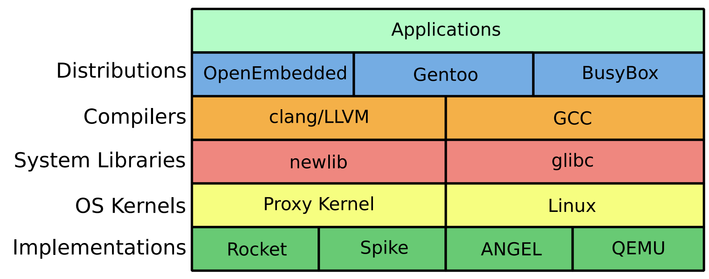
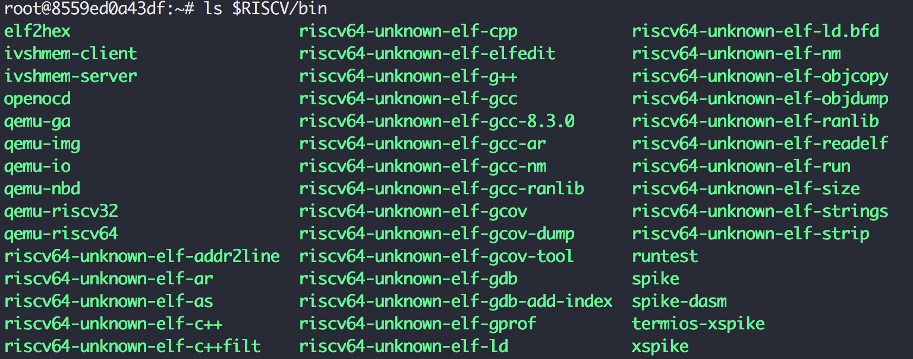

## General software stack




## Embedded system software stack

### What is newlib?

[https://en.wikipedia.org/wiki/Newlib](https://en.wikipedia.org/wiki/Newlib)
- C standard library implementation for **embedded system**
- GCC port for non-Linux embedded system
- When lacking of full-blown OS, how to **make a system call** and how to **use devices**

> Newlib code size will signaficant larger than Linux code size, because it includes the system calls that is already embedded inside Linux.

### What is cross-compile?

Cross-compiler
- A compiler capable of creating executable code for a platform other than the one on which the compiler is running
- In our case: RISC-V compiler running on top of x86


## Setup GNU toolchain for RISC-V

### 2 options

1. Build from scratch
2. Download pre-built version from SiFive (or other vendors)

> Here we choose option 1, because it's more useful in the future. You probably need to choose your own instruction subsets.


### 1. Download source

- Community version GNU toolchain on Github: https://github.com/riscv/riscv-gnu-toolchain
    - riscv-gcc
    - riscv-gdb
    - riscv-glibc
    - riscv-binutil
    - riscv-newlib
    - riscv-dejagnu

```shell
git clone https://github.com/riscv/riscv-gnu-toolchain --recursive
```


### 2. Install prerequisites

Ubuntu 16.04

```shell
sudo apt-get install -y autoconf automake autotools-dev curl libmpc-dev libmpfr-dev libgmp-dev gawk build-essential bison flex texinfo gperf libtool patchutils bc zlib1g-dev libexpat-dev
sudo apt-get install -y build-essential zlib1g-dev pkg-config libglib2.0-dev binutils-dev libboost-all-dev autoconf libtool libssl-dev libpixman-1-dev libpython-dev python-pip python-capstone virtualenv expect
sudo apt-get install -y autoconf automake autotools-dev curl libmpc-dev libmpfr-dev libgmp-dev libusb-1.0-0-dev gawk build-essential bison flex texinfo gperf libtool patchutils bc zlib1g-dev device-tree-compiler pkg-config libexpat-dev
```


### 3. Compile & install

```shell
git clone --recursive https://github.com/riscv/riscv-gnu-toolchain
    # this will take a long time to download

cd riscv-gnu-toolchain; mkdir build; cd build

../configure --prefix=/opt/riscv --with-arch=rv64gc --with-abi=ilp64d
    # --with-arch=rv64gc defines target architecture is rv64gc (64-bit IMACFD extentions support)
    # option example: rv64imac (64-bit IMAC extenstions support)
    # --with-abi=ilp64d defines target ABI (applicaiton binary interface)
    # "d" means hard-float
    # option example: ilp64 (64-bit soft float)

make newlib -j4 # compile & install
make report-newlib # run DejaGnu test suite (super slow)
```


### Toolchain directory content




## Assembly / programmer's handbook

*Please refer to handouts: **RISC-V Reference Card***

| Register      | ABI Name | Saver      | Description                       |
| ------------- | -------- | ---------- | --------------------------------- |
| x0            | zero     |            | Hard-wired zero                   |
| x1            | ra       | Caller     | Return address                    |
| x2            | sp       | **Callee** | Stack pointer                     |
| x3            | gp       |            | Global pointer                    |
| x4            | tp       |            | Thread pointer                    |
| x5-7 & x28-31 | t0-6     | Caller     | Temporaries                       |
| x8-9 & x18-27 | s0-11    | **Callee** | Saved registers                   |
| x10-17        | a0-7     | Caller     | Function arguments / return value |

&nbsp;

Separation of saved registers and temporary registers makes it possible to reduce 32 registers to 16 registers in E extension


## Assembly / what is ABI?

ABI (application binary interface) includes:

- Instruction set
- Calling convention
    - Function's argument passing and return value retrieving
        - Stack vs. registers
        - If stack, which parameter is pushed first?
        - If register, which registers are used for what?
- How to make system calls to operating system
    - More details in our next DEMO


### Assembly / `ra` return address

-   `ecall`: `ra <= PC + 4`
-   `ret`: jump back to `ra` (`PC <= ra`)


## Assembly / `sp` stack pointer

When goes into function call, save registers to stack
 
```
00000000000114da <_realloc_r>:
*   114da:       715d                    addi    sp,sp,-80      # reserve 80-byte space on stack
    114dc:       f84a                    sd      s2,48(sp)      # push s2
    114de:       e486                    sd      ra,72(sp)      # push ra
    114e0:       e0a2                    sd      s0,64(sp)      # push s0
    114e2:       fc26                    sd      s1,56(sp)      # push s1
    114e4:       f44e                    sd      s3,40(sp)      # push s3
...                                                             # push s4 ~ s7
    114ee:       e062                    sd      s8,0(sp)       # push s8
...                                                             # function
    115e0:       60a6                    ld      ra,72(sp)      # pop ra
    115e2:       6406                    ld      s0,64(sp)      # pop s0
    115e4:       854a                    mv      a0,s2
    115e6:       74e2                    ld      s1,56(sp)      # pop s1
...                                                             # pop s2 ~ s7
    115f4:       6c02                    ld      s8,0(sp)       # pop s8
*   115f6:       6161                    addi    sp,sp,80       # release 80-byte space on stack
    115f8:       8082                    ret                    # return
```


## Assembly / `gp` global pointer

`gp` = global pointer = pointer to global variables
-   GP is pointing at the center of `.data` section that allows program to index to any global variables easily without the need to `auipc` every time

### Example: C program uses global variables

```C
/* Global Variables: */
Boolean         Bool_Glob;
char            Ch_1_Glob,
                Ch_2_Glob;
Proc_4 () /* without parameters */ {
  Boolean Bool_Loc;
  Bool_Loc = Ch_1_Glob == 'A';
  Bool_Glob = Bool_Loc | Bool_Glob;
  Ch_2_Glob = 'B';
} /* Proc_4 */
```


### ASM disabled GP

```assembly
0000000040400826 <Proc_4>:
*   40400826:   3fc00797                auipc   a5,0x3fc00
    4040082a:   f777c783                lbu     a5,-137(a5) # 8000079d <Ch_1_Glob>
*   4040082e:   3fc00717                auipc   a4,0x3fc00
    40400832:   f7272703                lw      a4,-142(a4) # 800007a0 <Bool_Glob>
    40400836:   fbf78793                addi    a5,a5,-65
    4040083a:   0017b793                seqz    a5,a5
    4040083e:   8fd9                    or      a5,a5,a4
*   40400840:   3fc00717                auipc   a4,0x3fc00
    40400844:   f6f72023                sw      a5,-160(a4) # 800007a0 <Bool_Glob>
*   40400848:   3fc00797                auipc   a5,0x3fc00
    4040084c:   04200713                li      a4,66
    40400850:   f4e78a23                sb      a4,-172(a5) # 8000079c <Ch_2_Glob>
    40400854:   8082                    ret
```


```c
00000000400003f0 <Proc_4>:
    400003f0:   8651c783                lbu     a5,-1947(gp) # 80001fbd <Ch_1_Glob>
    400003f4:   8681a703                lw      a4,-1944(gp) # 80001fc0 <Bool_Glob>
    400003f8:   fbf78793                addi    a5,a5,-65
    400003fc:   0017b793                seqz    a5,a5
    40000400:   00e7e7b3                or      a5,a5,a4
    40000404:   86f1a423                sw      a5,-1944(gp) # 80001fc0 <Bool_Glob>
    40000408:   04200713                li      a4,66
    4000040c:   86e18223                sb      a4,-1948(gp) # 80001fbc <Ch_2_Glob>
    40000410:   00008067                ret
```


## Assembly / `tp` thread pointer

`tp` (thread pointer) is a pointer to thread-level global variables (aka thread-local storage)


## Assembly / code example

### @DEMO

- Directory `~/riscv-training/lab/21-lab.compile`
    - Source code `example-asm.s` and `example-c.s`

#### Function of `example-asm.s`

- 4x4 Matrix multiplication, and result checking against Excel
- Use 2-level function calls to do the job
    - Demostrate calling convention by passing argument and return value via registers `a*`
    - Save registers `s*` to stack before using them

#### Compare with `example-c.c` with the same functionality

- Assembly code is much harder to write and debug for normal functionality
- Assembly code's binary size is smaller (6624 bytes vs. 6000 bytes)


## Assembly / what is linker script?

- Describe how the sections in the input files should be mapped into the outpufile
- Control the memory layout of the output file

### Entry point
- The first instruction to execute in the problem

### Common section
- `.text`: actual machine instructions
- `.data`: static data in your code
- `.bss`: uninitialized global or static variables, will be initialized to zero during startup
    - `.noinit`: part of bss but will not be initialized to zero


## Assembly / compile assembly

### Compile -> link -> objdump

```shell
# assemble
${RISCV}/bin/riscv64-unknown-elf-as example-asm.s -o example-asm.o
# link
${RISCV}/bin/riscv64-unknown-elf-ld -T linker-asm.ld example-asm.o -o example-asm.elf
# object dump
${RISCV}/bin/riscv64-unknown-elf-objdump -D example-asm.elf > example-asm.elf.dump
```

### Linker script

```bsp
SECTIONS
{
    . = 0x10000;
    .text : { *(.text) }
    .data : { *(.data) }
}

ENTRY (_start)
```

- Both code and data start from `0x0001_0000`
- `_start` is the entry point label


## Assembly / compile C code

### Compile bare-metal C program

```
# compile
${RISCV}/bin/riscv64-unknown-elf-gcc example-c.c -o example-c.elf
# object dump
${RISCV}/bin/riscv64-unknown-elf-objdump -D example-c.elf > example-c.elf.dump
```


## Assembly / ASM vs. C

### Development effort

Myself
- 2 hours in ASM
- 2 mins in C

### Size of the code

With `printf`
```
riscv@riscv:~/riscv-training/lab/21-lab.compile$ ll *.elf
-rwxr-xr-x 1 1380539737 1876110778   6000 Dec  7 17:07 example-asm.elf*
-rwxr-xr-x 1 1380539737 1876110778 138792 Dec  7 17:18 example-c.elf*
```

Without `printf` and turn on `-Os`: 107.2%
```
-rwxr-xr-x 1 1380539737 1876110778 6000 Dec  7 17:30 example-asm.elf*
-rwxr-xr-x 1 1380539737 1876110778 6432 Dec  7 17:30 example-c.elf*
```


## SPIKE

- SPIKE: official ISS (instruction set simulator) of RISC-V
    - GDB-like TUI (text-based user interface)
    - Support single step execution / breakpoint / watchpoint
    - XSPIKE: open a separate terminal (in GUI mode) to capture the `printf` output

### How to invoke SPIKE

```shell
# run SPIKE in direct mode
> ${RISCV}/bin/spike target.elf

# run SPIKE in interactive debug mode: -d
> ${RISCV}/bin/spike -d target.elf

# run SPIKE with log dumping: -l
> ${RISCV}/bin/spike -l target.elf 2>&1 | less
```


### SPIKE interactive debug mode

- `: pc 0`: show current PC in core 0
- `: reg 0 a0`: show content of register `a0` in core 0
- `: mem 2020`: show content of memory at `0x2020`
- `: until pc 0 80000000`: stop when PC hits `0x8000_0000`

More commands type `help` under interactive debug mode

> Note: don't forget the "0" for core 0


### @DEMO

- Run SPIKE in direct mode
- Run SPIKE in interactive debug mode
    - Show register/memory content
    - Set breakpoint
- Run SPIKE with log dumping


.footnote[Next session: LAB] 


## @LAB: factorial in assembly

### Use assembly to implement factorial function
### `n! = n * (n-1) * (n-2) * ... * 2 * 1`


