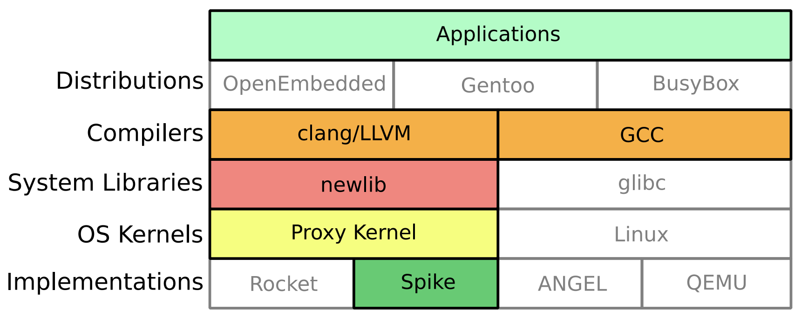
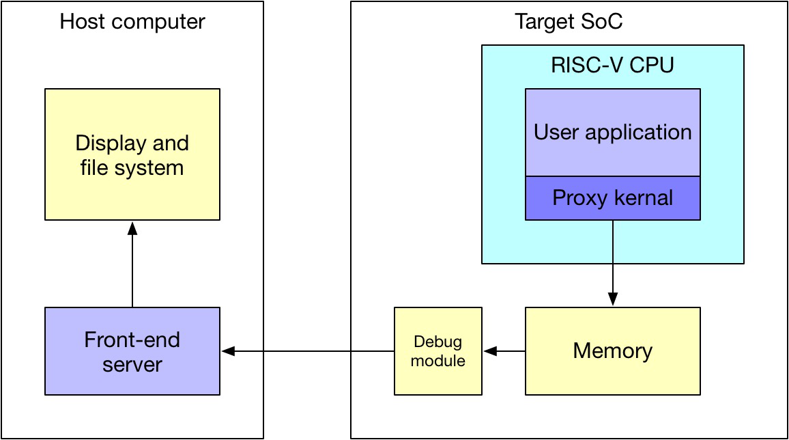

## PK and FESVRV

-   PK (proxy kernel) & FESVR (front-end server)
    -   For debug and system bring up
    -   PK is an abstraction of kernel that provides system services through FESVR running on host




-   PK is running on target CPU, while FESVR is running on host computer




## PK and FESVR / code example

### `printf` in modified version of `spike`


```shell
*# Original spike
> cd ~/riscv-training/lab/22-lab.system-call
> spike ../pk hello.elf
bbl loader
Hello world!

*# Modified spike (print out all system call)
> cd ~/riscv-training/lab/22-lab.system-call
> ~/riscv-git/riscv-tools/riscv-isa-sim/build/spike ../pk hello.elf
bbl loader
fesvr::sys_getmainvars (0x 8000d860 200 0 0 0 0 0)
fesvr::sys_openat (0x ffffffffffffff9c 8000d8b5 a 0 0 0 0)
fesvr::sys_pread (0x 3 8000d600 40 0 0 0 0)
...
fesvr::sys_pread (0x 3 80830000 1000 a000 0 0 0)
fesvr::sys_fstat (0x 1 80024df0 0 0 0 0 0)
fesvr::sys_pread (0x 3 8082c000 1000 6000 0 0 0)
fesvr::sys_write (0x 1 80834230 d 0 0 0 0)
Hello world!
fesvr::sys_exit (0x 0 0 0 0 0 0 0)
```


## PK and FESVR / system call


### `tohost` and `fromhost`

-   Memory location: shared knowledge between PK and FESVR
-   Both are 32-bit size, that can be read/write with single access
-   Follow producer-consumer model
    -   `tohost` is written by PK, cleared by FESVR
    -   `fromhost` is written by FESVR, cleared by PK


### `magicmem`

-   `tohost` and `fromhost` are too small to communicate real data structure. They only store the address of `magicmem`
-   Syscall type, arguments and return values are stored in `magicmem`


### Syscall entry point in PK

`~/riscv-git/riscv-tools/riscv-pk/pk/syscall.c`

### Syscall handler in FESVR

`~/riscv-git/riscv-tools/riscv-isa-sim/fesvr/syscall.cc`


## PK and FESVR / system call workflow

> Please remember, this is for debugging hardware and system bring-up, sometimes co-processor running enviroment. And it's good for understanding application/kernel interaction.

| Target side (PK on RISC-V)                    | Host side (FESVR on x86)                                 |
| --------------------------------------------- | -------------------------------------------------------- |
| User-level code: `ecall` and trap into PK     |                                                          |
| Write syscall arguments into **magicmem**     |                                                          |
| Write address of **magicmem** into **tohost** | Looping: read **tohost** until it's non-0                |
|                                               | Read **magicmem**                                        |
| Looping: read **tohost** until it's 0         | Write 0 to **tohost**                                    |
|                                               | Deal with syscall. Write return values into **magicmem** |
| Looping: read **fromhost** until it's non-0   | Write address of **magicmem** into **fromhost**          |
| Read **magicmem**                             |                                                          |
| Write 0 to **fromhost**                       | Looping: read **fromhost** until it's 0                  |


## PK and FESVR / verification exit

### Another very useful scenario

- To pass exit code in verification. It's embedded inside the `riscv-tests` verification suite.
- `RVTEST_PASS` and `RVTEST_FAIL` in `~/riscv-git/riscv-tools/riscv-tests/env/p/riscv_test.h`

```c
#define RVTEST_PASS                                                     \
        fence;                                                          \
        li TESTNUM, 1;                                                  \
        ecall

#define TESTNUM gp
#define RVTEST_FAIL                                                     \
        fence;                                                          \
1:      beqz TESTNUM, 1b;                                               \
        sll TESTNUM, TESTNUM, 1;                                        \
        or TESTNUM, TESTNUM, 1;                                         \
        ecall
```


## @LAB: new system call

### Add new system call to synchronize system time between target and host

Read CSR of `mtime` to get system time on RISC-V CPU

Need to use assembly code to get `mtime`


