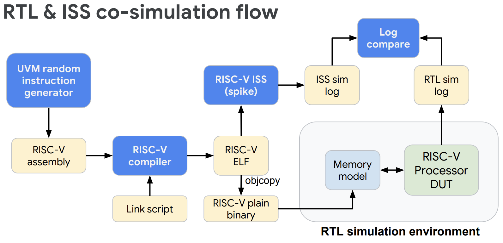
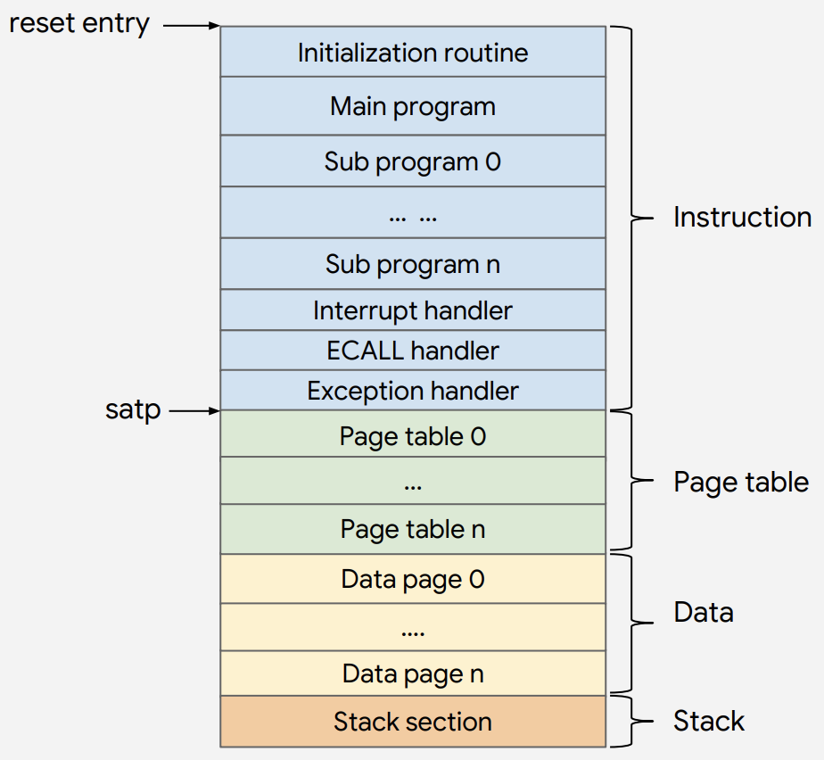

## riscv-tests

https://github.com/riscv/

-   Unit tests based on assembly
    -   Basic functionality of each RISC-V instructions and features defined in the spec
    -   Very good staring point to find basic implementation issues
-   Software BIST (built-in self test)
    -   Compare architecture states with expected results
    -   Issue pass/fail signal to host machine
-   Official compliance tests

## riscv-tests / TVM (test virtual machine)

-   Because RISC-V is very scalable, so it has many variants
    -   E.g. 32-bit vs 64-bit, different ISA subsets support, different privilege levels support

### Use different TVM to define RISC-V variants

-   Registers (GPR, FPR) and instruction sets
-   Memory access pattern
-   How to enter/exit test program
-   How to do input/output in test program

### Some available TVM

| TVM Name | Description                                          |
| -------- | ---------------------------------------------------- |
| `rv32ui` | RV32 user-level, integer only                        |
| `rv32si` | RV32 supervisor-level, integer only                  |
| `rv32mi` | RV32 machine-level, integer only                     |
| `rv64ui` | RV64 user-level, integer only                        |
| `rv64uf` | RV64 user-level, integer and floating-point          |
| `rv64uv` | RV64 user-level, integer, floating-point, and vector |
| `rv64si` | RV64 supervisor-level, integer only                  |
| `rv64sv` | RV64 supervisor-level, integer and vector            |

## riscv-tests / target environments

-   Despite of TVM, there is also **target environment** that defines **implementation** related factors
    -   Virtual memory
    -   Multi-core
    -   Time interrupt
-   Target environments

| Target Environment Name | Description                                                  |
| ----------------------- | ------------------------------------------------------------ |
| `p`                     | virtual memory is disabled, only core 0 boots up             |
| `pm`                    | virtual memory is disabled, all cores boot up                |
| `pt`                    | virtual memory is disabled, timer interrupt fires every 100 cycles |
| `v`                     | virtual memory is enabled                                    |

-   `p` is the mostly used and supported

## riscv-tests / how to use TVM?

-   Select the correct target enviroment according to your implemenation
-   Pick all the TVMs that fits your implemenation
-   E.g. 32-bit bare-metal MCU that supports IM
    -   `rv32mi-p-*` & `rv32ui-p-*` & `rv32um-p-*`
-   E.g. 64-bit full-blown single-core AP that supports IMACFD and Linux
    -   `rv64mi-p-*` & `rv64ui-v-*` & `rv64um-v-*` & `rv64uf-v-*` & `rv64ud-v-*` & `rv64ua-v-*` & `rv64uc-v-*` & `rv64si-p-*`

&nbsp;

.center[As we can see, **riscv-tests are also scalable**]

## riscv-tests / demo

-   ISA test source code for target env `p`
    -   Source code: `~/riscv-git/riscv-tools/riscv-tests/isa/rv64ui/addi.S`
    -   Header file: `~/riscv-git/riscv-tools/riscv-tests/env/p/riscv_test.h`
        -   And linker script: `~/riscv-git/riscv-tools/riscv-tests/env/p/link.ld`
    -   Objdump: `~/docker/riscv/riscv-tools/riscv-tests/isa/rv64ui-p-addi.dump`
-   ISA test source code for target env `v` (with virtual memory)
    -   Header file: `~/riscv-git/riscv-tools/riscv-tests/env/v/riscv_test.h`
        -   Entry assembly: `~/riscv-git/riscv-tools/riscv-tests/env/v/entry.S`

## riscv-torture

https://github.com/ucb-bar/riscv-torture

-   Random test generator from UC Berkeley
    -   Generate random instruction sequences
    -   Use SPIKE simulator to generate golden reference architecture states
    -   Automatic compare, then determine pass/fail
-   Pros & cons
    -   Support selecting ISA extension and instruction
    -   Written in Scala (slow and poor compatibility), need internet connection
    -   The program structure is too simple
        -   Lack of complicated program sequence verification
    -   Lack of switching between privilege modes
    -   Has not updated for a very long time

## riscv-dv

https://github.com/google/riscv-dv

-   Open-source instruction generator from Google
-   Based on SystemVerilog and UVM
    -   Industry standard verification language and framework
        -   Other engineers can understand and extend
        -   **It's not a one-man project**
    -   Support SV based coverage
-   Use SPIKE simulator as golden reference

## riscv-dv / simulation flow

## riscv-dv / interesting features

### Randomize everything

-   3 levels of randomness
    -   Instrution-level
        -   Cover all instructions
    -   Sequence-level
        -   Instruction orders and dependencies
    -   Program-level
        -   Privileged modes switching, page table, system calls

-   Difficulties
    -   Branch/jump
        -   Valid target?
        -   Avoid infinite loop
    -   Load/store
        -   Valid base address
        -   Extra instruction to setup base address
    -   CSR access
        -   Most CSRs have implications, cannot be randomly changed
        -   Some CSRs are implementation-specific, so not 100% match SPIKE behavior
    -   Call stack
        -   Randomly generated function calls can easily form infinite loop
    -   Page table
        -   Exception injection

### Architecture aware

-   Need to know certain level of implementation/architecture details to target specific corner cases
-   E.g.
    -   Branch prediction
    -   TLB
    -   Cache
    -   Multi-issue

### Performance

-   Why? Because this is usually the bottleneck when use FPGA to emulate CPU.

## riscv-dv

### Generator flow

### memory map

## riscv-dv / limitations

-   Only support RV64IMC & RV32IMC
    -   Lack of various ISA subsets support
-   Only support commercial RTL simulator 

