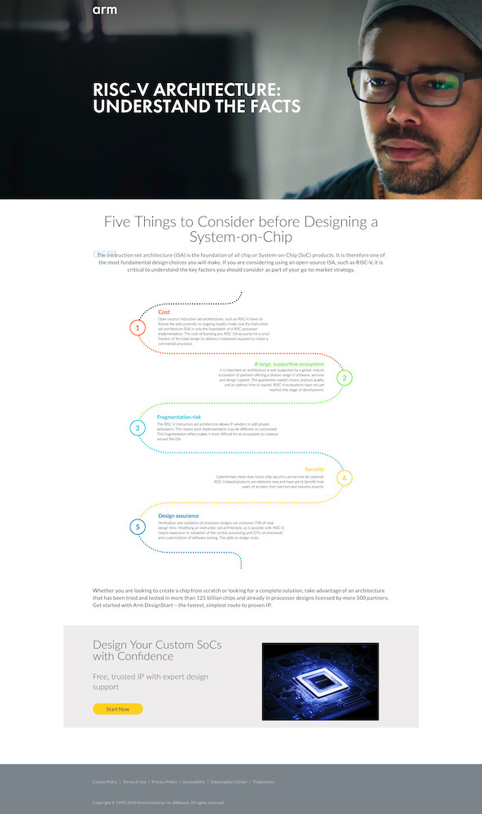

[//]:# (BEGIN title_page('Schedule'))
title: Schedule
class: animation-fade
layout: true

<!-- This slide will serve as the base layout for all your slides -->

.bottom-bar[
RISC-V Training - Created by Jim Wang (http://phdbreak99.github.io) - July 2019 - All rights Reserved
]

---

class: impact

## RISC-V Training

&nbsp;

# Schedule

&nbsp;

Jim Wang (http://phdbreak99.github.io)

July 2019

[//]:# (END)

---

class: center

## Momentum: 2018 RISC-V Summit

<!-- video of 2018 RISC-V Summit -->

<video width="800" height="480" controls>
    <source src="./video/risc_v_summit_2018_-EzMF4m1vU8_1080p.mp4" type="video/mp4">
</video>

---

class: center

## Fun moment: anti-RISCV website by ARM

---

class: middle

## Schedule

### 2-day x 8-hour

### Step-by-step

### Lecture + demo + DIY

<!--
因为只有两天，所以也只能讲个大概，很多topic不能深入。而RISC-V方面，我自己本人更多的涉猎的是架构、硬件，以及一部分底层软件方面的工作，很多软件层面的内容我本人也不是专家，所以就不在这里不懂装懂了。大家都是做软件开发工作的也应当明白抽象和封装的概念，因为到了driver和OS层面，大部分东西都是相通的。尤其是到了OS以上的层次，Linux boot up起来之后很多东西都可以直接拿来用了，是RISC-V也好，是ARM也罢，只要compiler不出bug，最后就只能看到性能的区别了。
同样的，在我以前的工作中也遇到了一些RISC-V特有的东西，需要给做软件的同事进行解释和普及，一方面是由于RISC-V ISA本身还很新，设计的也不算是非常完善，比如说memory model, ordering issue 都还在完善的过程中，所以对软件就有一定的限制。另一方面也是很多人使用ARM时间比较长，有一些思维定势需要转换到RISC-V的语境底下。这方面的内容如果大家感兴趣，我可以到时候展开来讲。
-->

---

## Schedule / Day 1 morning

- **Schedule and self-introduction**
- **Introduction of RISC-V open ISA** <!-- ./10-intro.md -->
    - History and current status of ecosystem
- **RISC-V ISA: unprivileged spec** <!-- ./20-isa-basic.md -->
    - Basic RISC-V ISA: key concepts
- **DIY 0: setup course DIY env** <!-- ./diy-0-setup.md -->
    - Quick introduction of DIY env used in this course
- *Lunch break*

---

## Schedule / Day 1 afternnon

- **Demo 1: compile assembly code and simulate on SPIKE** <!-- ./demo-1-compile.md -->
    - GNU toolchain, assembly code example, compile & link, SPIKE simulator
- **DIY 1: compile assembly code and simulate on SPIKE** <!-- ./diy-1-compile.md -->
    - Code your own assembly code, compile & link, run simulation on SPIKE
- *Tea break*

- **RISC-V ISA: privileged spec** <!-- ./30-isa-privileged.md -->
    - Privilege modes, exception & interrupt, physical memory & virtual memory
- **Demo 2: C code with proxy kernel and front-end server** <!-- ./demo-2-syscall.md -->
    - RISC-V sim env components, system call workflow, use PK to run "hello world" in SPIKE
- **DIY 2: create new system call** <!-- ./diy-2-syscall.md -->
    - Change FESVR and PK to add a new system call, write C code to call this system call

---

## Schedule / Day 2 morning

- **CPU architecture with RISC-V examples** <!-- ./40-cpu-arch.md -->
    - Basic concepts of CPU architecture, and some real RISC-V CPU examples
- **Demo 3: verification suite** <!-- ./demo-3-verif-suite.md -->
    - ISA tests and built-in-self-check, Torture: random code generator
- **Demo 4: RocketChip generator** <!-- ./demo-4-rocketchip.md -->
    - CPU architecture exploration with RocketChip generator
- **DIY 4: generate new CPU with RocketChip** <!-- ./diy-4-rocketchip.md -->
    - Configure RocketChip in Chisel to generator new CPU, and run benchmark

- *Lunch break*

---

## Schedule / Day 2 Afternoon

- **Demo 5: Freedom IDE & HiFive1 board**
    - Quick example of SiFive's Freedom IDE, and debugging HiFive dev board
- **Uncore components** <!-- ./50-uncore.md -->
    - TileLink, PLIC, CLINT, CLIC, debug, trace
- **Demo 6: create custom instruction** <!-- ./demo-6-custom-inst.md -->
    - Select instruction encoding, change GCC to support new instruction
- *Tea break*
- **Demo 7: QEMU full system emulator**
    - Boot linux in QEMU
    - Linux binary vs. newlib binary
- **Vector extension (backup)**
    - RISC-V's answer to machine-learning

---

## Self-Introduction

### 王 君 (Jim Wang)

.col-7[
http://phdbreak99.github.io

本科：清华大学电子工程系

博士：中科院计算所龙芯

工作：
- Samsung: senior design engineer
- Marvell: design manager
- Startup: founding engineer & chief architect
- Some 404 company

方向：
- CPU & SoC architecture
- Software hardware co-design
]

.col-5[

]
