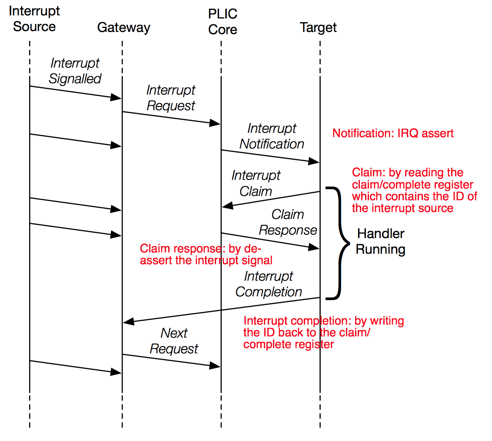

[//]:# (BEGIN title_page('Uncore'))
title: Uncore
class: animation-fade
layout: true

<!-- This slide will serve as the base layout for all your slides -->

.bottom-bar[
RISC-V Training - Created by Jim Wang (http://phdbreak99.github.io) - July 2019 - All rights Reserved
]

---

class: impact

## RISC-V Training

&nbsp;

# Uncore

&nbsp;

Jim Wang (http://phdbreak99.github.io)

July 2019

[//]:# (END)

---

[//]:# (BEGIN toc_page( 'Uncore', 'Interrupt Controller', 'TileLink', 'Debug', 'Summary' ))
name: toc

## Table of Content

.col-1[

&nbsp;

{{content}}

]

.col-11[

&nbsp;

### Uncore

### Interrupt Controller

### TileLink

### Debug

### Summary

]

[//]:# (END)

--

[//]:# (BEGIN toc)
template: toc

### >>>>
[//]:# (END)

---

class: center, middle

## Uncore

### CPU core is fun, but uncore is the real work.

---

## Uncore / components

.col-6[

- Cache (already discussed)
- Interrupt controller
- Network Fabric
- Debug

]

.col-6[

]

---

[//]:# (BEGIN toc)
template: toc

### &nbsp;

### >>>>
[//]:# (END)

---

## Interrupt recap

3 types of interrupts

- External: peripheral devices
- Software: inter-processor interrupt
- Timer: timely schedule tasks

### PLIC (platform level interrupt controller)
-   For external interrupts
-   Aggregation of multiple external interrupts
    -   Provide enable/priority

### CLINT (core level interruptor)
-   For software & timer interrupts
-   Provide memory-mapped software/timer interrupt CSRs

---

## PLIC (platform-level interrupt controller)

### MSI vs. IRQ

| MSI (message signaled interrupt)             | IRQ (physical wired interrupt)                     |
| -------------------------------------------- | -------------------------------------------------- |
| Relatively newer                             | Traditional and easy to understand                 |
| More complex device and interrupt controller | Simple to implement. Widely supported              |
| Scalable, especially for morden large SoCs   | Don't scale well                                   |
| In-band access, easy for timing/clock/etc.   | Out-of-band, nightmare for physical design if many |

&nbsp;

### Interrupt controller for RISC-V: PLIC

-   Simple & easy to use
-   IRQ-style interrupt aggregator
-   Support programmable priority and enable
-   Support multiple source and multiple target

---

## PLIC / function diagram

IRQ-style interrupt aggregator that support **enable/priority** and **claim/complete** flow

.col-6[

-   Function components
    -   Gateway
        -   Forward enabled interrupts
        -   Stop further interrupts if current one is not claimed
    - PLIC core
        -   Order interrupts by their priority
        -   Filter interrupt with priority threshold
]

.col-6[

]

---

## PLIC / configurations

-   Interrupt enable
    -   Every interrupt initiator has an enable bit

-   Interrupt priority
    -   Every interrupt initiator has a priority level assigned. By default 8 levels, the larger the number the higher priority it has
    -   Level 0 is reserved for “never interrupt”

-   Priority threshold
    -   Only interrupts have higher priorities will presented to target

---

## PLIC / software-hardware workflow

.col-6[

1. Signalled: IRQ from source to gateway
2. Request: IRQ from gateway to core
3. Notification: IRQ assert from core to target
4. Claim: memory read from target to core, start trap handler
5. Response: IRQ deassert from core to target
6. ... (waiting for trap handler to finish)
7. Complete: memory write from target to core

]

.col-6[

]

---

## PLIC / interrupt handler

---

## CLINT

### Timer interrupt

-   Memory-mapped CSR `mtime` and `mtimecmp`

### Software interrupt

-   Memory-mapped CSR `msip` (machine-mode software interrupt pending)

---

## CLINT / interrupt handler

### Timer interrupt

-   Set timer: CPU read `mtime`, thenwrite `mtimecmp` with number larger than `mtime`
-   Claim: by writing `mtimecmp` with number smaller than `mtime` to disable/clear timer interrupt

### Software interrupt

-   Raise software interrupt: write memory-mapped CSR `msip`
-   Claim: clear `msip`

---

[//]:# (BEGIN toc)
template: toc

### &nbsp;

### &nbsp;

### >>>>
[//]:# (END)

---

## TileLink

### Goal of TileLink

-   Non-ARM interconnect protocol
    -   Cannot use ARM's open protocol: AMBA (CHI, ACE, AXI, AHB, APB)
    -   They are open, but fully controlled by ARM. Huge problem for ARM's rival.
-   Protocol framework to unify different usage scenarios
    -   Clean slate, start from scratch, learn from priors
    -   Decouple message protocol from wire protocol
        -   Even support off-chip connection
-   Simple & hardware-friendly

TileLink is also developed inside UCB BAR.

TileLink is not **tied** with RISC-V. RocketChip uses TileLink.

---

## TileLink / overview

### Different usage scenarios

-   Point-to-point simple protocol for data transfer
-   More complicated data transfer with burst, atomic support
-   Cache-coherent hardware support

### 5 levels of priorities/channels: A, B, C, D, E

-   Avoid deadlock: acknowledges have higher priority
-   Support out-of-order design for better performance, while support ordering when needed
-   Not always need 5 levels of priorities. Simple data transfer will only need 2

### Point-to-point, master-slave model

-   No race for ownership physically

---

## TileLink / conformance levels

Corresponding to 3 usage scenarios

### TL-UL (TileLink uncached light-weight)
-   Just read and write operations

### TL-UH (TileLink uncached heavy-weight)
-   Add burst, atomic support
-   Add hint operations, such as prefetch

### TL-C (TileLink cached)
-   Add support to cache-coherent

---

## TileLink / channel priorities

### Channel A, B, C, D, E

-   Each channel has its specified priority
    -   In the order of \\(A<B<C<D<E\\)
-   Channel has only one direction
-   Physically independent

---

## TileLink / TL-UL

-   Channel A: memory access request from master to slave
-   Channel D: memory access response from slave to master

---

## TileLink / TL-UH

-   Arithmetic & logical: atomic operation (read-modify-write)
-   Hint: prefetch data with intent to read/write

---

## TileLink / TL-C

-   Acquire: master to slave
    -   To obtain cache block to make it local, or write permission of a cache block it already has
-   Grand: slave to master
    -   As a response to acquire
-   Probe: slave to master
    -   To query or modify the permission of cache
-   Release: master to slave
    -   To downgrade its permission of a cache block

---

## TileLink / wire protocol

-   Physically independent channel for each priority (A/B/C/D/E)
-   Ready-valid hand-shaking protocol
    -   The waiting time could be arbitrary
-   Burst transmissions + serialization (variable bus width)
    -   Between burst beats, only data field changes
    -   Size must align with 2^N, the size field is just the N
    -   Number of beats is calculated from size, no special indicator

---

## TileLink / memory read example

---

## TileLink / memory write example

---

## TileLink / cache coherency

Hardware supported cache coherency will be discussed in later session

---

## TileLink / products

SiFive's CPU core complex is built on TileLink. So it's silicon proven.

-   Crossbar, adapters, switch
-   Snooping-based cache-coherent manager
-   Bridges to AMBA protocol

https://github.com/chipsalliance/rocket-chip/tree/master/src/main/scala/tilelink

&nbsp;

**Problem? All in Chisel ...**

---

[//]:# (BEGIN toc)
template: toc

### &nbsp;

### &nbsp;

### &nbsp;

### >>>>
[//]:# (END)

---

## Debug / spec

### What is debug spec for?

- Debug software, either embedded or kernel
- Help with system bring up before any working CPU on the chip
- Standardize interface between software and hardware debugger

### What is debug spec not for?

- Find hardware bugs, but can help to narrow them down

### 3 parts of the debug system

- Debugger software running on the host, like GDB or some GUI IDE
- Debugger hardware connecting host to target, e.g. TRACE32, J-Link
- Silicon block inside the target chip
    - Auto discovery; protocol translation; message passing; runtime control; cross-triggering; etc

---

## Debug spec

### principle

- **"Software is King"**
    - Helping software (including kernel) debug is the primary goal
- Decoupled from implemetation, both silicon and debugger
- Simple & hardware friendly (again)

---

## Debug spec / system diagram

.col-6[

]

.col-6[
- Need to distinguish
    - Inside / outside of the chip
    - Software / hardware
]

---

## Debug / components

.col-6[
### DTM (debug transport module)
- General interface for different protocols, e.g. JTAG, SPI, USB, etc.
- Right now, only JTAG is defined, but SPI is also supported

### DMI (debug module interface)
- Interface bus between DTM and DM
- It is implemenataion dependent, can be TileLink or AMBA

### DM (debug module)
- The core of the debug silicon block
- Provides runtime control, abstract commands, function fabric access
]

.col-6[

]

---

## Debug / function of debug module

.col-6[
### Reset control
- Output a global reset signal, `ndmreset` (non-debug module reset)
- So that we can debug the first instruction out of reset

### Selecting harts
- Debugger can select one or multiple harts to debug

### Run control
- Halt, resume, halt-on-reset, reset, singl-step
]

.col-6[

### Abstract commands
- Abstract commands can be injected by debugger to direct CPU carrying out specific commands
- Access registers: GPR, CSR, FPR, etc.
- Quck access: quickly inject some commands for CPU to execute while it's still running
- Access memory

]

---

## Debug / triggering

### How to go into debug mode?
- Breakpoint
    - Also `EBREAK` instruction
- Watchpoint: register
- Cross-trigger
    - Other core encounters a breakpoint
    - Other component hits certain condition

---

## Debug / security

Another big topic in debug is **security**.

- Debug system is powerful, can access almost all the resource
- Big security loophole if left open after production phase

### What to do?
- Use fuse bit to disable debug after production phase
- Add authentication step before going into debug mode

---

## Debug / debugger

Software running on the host. No matter has GUI or not.

### Open source: OpenOCD + GDB
- Currently only support JTAG interface
- Support runtime control, abstract commands
- Support hardware breakpoints & watchpoints

### Commercial
- Lauterbach: TRACE32
- Segger: J-Link
- UltraSoC: UltraDev2

---

class: middle, center

## Debug / heterogenous SoC 

&nbsp;

&nbsp;

### Discussion: what is in your pocket?

---

[//]:# (BEGIN toc)
template: toc

### &nbsp;

### &nbsp;

### &nbsp;

### &nbsp;

### >>>>
[//]:# (END)

---

## Summary

Uncore includes blocks that support CPU core's functionality, but not peripheral.

.footnote[Note: ISA includes specs that defines software/hardware interface]

.col-6[

### Interrupt controller
- 3 types of interrupts
    - External/software/timer
- PLIC: external interrupt aggregator
- CLINT: software/timer interrupt
- Software/hardware co-workflow

### Debug
- Run-control and abstract command
- Decouple implementation of software/hardware, host/target

]

.col-6[

### Cache
- No spec, implementation dependent

### Network fabric
- No spec, implementation dependent
- TileLink: not a part of RISC-V ISA spec

]

---

[//]:# (BEGIN thanks)
class: middle, center

[//]:# (END)
