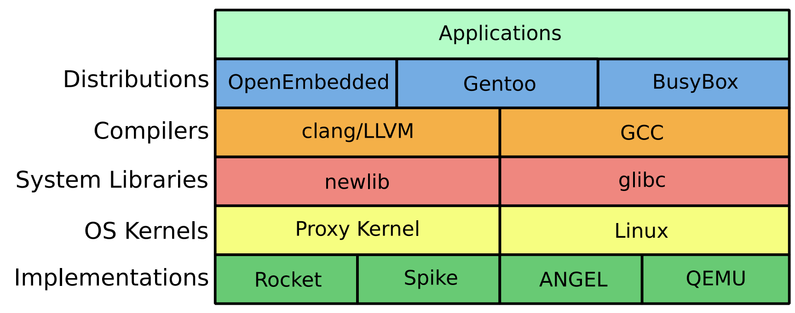

[//]:# (BEGIN title_page('Demo 1: Bare-metal assembly & SPIKE simulator'))
title: Demo 1: Bare-metal assembly & SPIKE simulator
class: animation-fade
layout: true

<!-- This slide will serve as the base layout for all your slides -->

.bottom-bar[
RISC-V Training - Created by Jim Wang (http://phdbreak99.github.io) - July 2019 - All rights Reserved
]

---

class: impact

## RISC-V Training

&nbsp;

# Demo 1: Bare-metal assembly & SPIKE simulator

&nbsp;

Jim Wang (http://phdbreak99.github.io)

July 2019

[//]:# (END)

---

[//]:# (BEGIN toc_page('Software stack', 'GNU toolchain', 'Assembly', 'SPIKE'))
name: toc

## Table of Content

.col-1[

&nbsp;

{{content}}

]

.col-11[

&nbsp;

### Software stack

### GNU toolchain

### Assembly

### SPIKE

]

[//]:# (END)

---

[//]:# (BEGIN toc)
template: toc

### >>>>
[//]:# (END)

---

## General software stack



---

## Embedded system software stack

### What is newlib?

[https://en.wikipedia.org/wiki/Newlib](https://en.wikipedia.org/wiki/Newlib)
- C standard library implementation for **embedded system**
- GCC port for non-Linux embedded system
- When lacking of full-blown OS, how to **make a system call** and how to **use devices**

> Newlib code size will signaficant larger than Linux code size, because it includes the system calls that is already embedded inside Linux.

### What is cross-compile?

Cross-compiler
- A compiler capable of creating executable code for a platform other than the one on which the compiler is running
- In our case: RISC-V compiler running on top of x86

---

[//]:# (BEGIN toc)
template: toc

### &nbsp;

### >>>>
[//]:# (END)

---

## Setup GNU toolchain for RISC-V

### 2 options

1. Build from scratch
2. Download pre-built version from SiFive (or other vendors)

> Here we choose option 1, because it's more useful in the future. You probably need to choose your own instruction subsets.

---

## Setup GNU toolchain for RISC-V (cont'd)

### 1. Download source

- Community version GNU toolchain on Github: https://github.com/riscv/riscv-gnu-toolchain
    - riscv-gcc
    - riscv-gdb
    - riscv-glibc
    - riscv-binutil
    - riscv-newlib
    - riscv-dejagnu

```shell
git clone https://github.com/riscv/riscv-gnu-toolchain --recursive
```

#### ====== @DIY ======

skip this step because it will take a very long time. `*.tgz` is provided for this training.

```shell
tar xf riscv-gnu-toolchain.tgz.tgz
```

---

### 2. Install prerequisites

Ubuntu 16.04

[//]:# (BEGIN include_code('~/docker/dev/riscv.sh/riscv-gnu-toolchain/00-prepare.sh', 'shell'))
```shell
# filename: ~/docker/dev/riscv.sh/riscv-gnu-toolchain/00-prepare.sh
apt-get install -y autoconf automake autotools-dev curl libmpc-dev libmpfr-dev libgmp-dev gawk build-essential bison flex texinfo gperf libtool patchutils bc zlib1g-dev libexpat-dev
apt-get install -y build-essential zlib1g-dev pkg-config libglib2.0-dev binutils-dev libboost-all-dev autoconf libtool libssl-dev libpixman-1-dev libpython-dev python-pip python-capstone virtualenv expect
```
[//]:# (END)

> - please remember to add `sudo`
> - because in docker, by default its login is root user, so omitted the `sudo` command


---

## Setup GNU toolchain for RISC-V (cont'd)

### 3. Compile & install

[//]:# (BEGIN include_code('~/docker/dev/riscv.sh/riscv-gnu-toolchain/10-build-compiler-rv64gc-newlib.sh', 'shell'))
```shell
# filename: ~/docker/dev/riscv.sh/riscv-gnu-toolchain/10-build-compiler-rv64gc-newlib.sh 
mkdir -p /opt/riscv/rv64gc; cd riscv-gnu-toolchain; mkdir build-rv64gc-newlib; cd build-rv64gc-newlib

../configure --prefix=/opt/riscv/rv64gc --with-arch=rv64gc --with-abi=ilp64d
    # --with-arch=rv64gc defines target architecture is rv64gc (64-bit IMACFD extentions support)
        # option example: rv64imac (64-bit IMAC extenstions support)
    # --with-abi=ilp64d defines target ABI (applicaiton binary interface)
        # "d" means hard-float
        # option example: ilp64 (64-bit soft float)

make newlib -j6 # compile & install
make report-newlib # run DejaGnu test suite (super slow)
```
[//]:# (END)

#### ====== @DIY ======

try to compile and install rv32gc compiler. But it will take quite some time to finish.

```
# inside docker
cd ~/docker/riscv
source ../dev/riscv.sh/riscv-gnu-toolchain/11-build-compiler-rv32gc-newlib.sh
```

---

## Setup GNU toolchain for RISC-V (cont'd)

### result: toolchain directory `/opt/riscv/rv64gc/bin`


---

[//]:# (BEGIN toc)
template: toc

### &nbsp;

### &nbsp;

### >>>>
[//]:# (END)

---

## Assembly / programmer's handbook

*Please refer to handouts: **RISC-V Reference Card***

| Register      | ABI Name | Saver      | Description                       |
| ------------- | -------- | ---------- | --------------------------------- |
| x0            | zero     |            | Hard-wired zero                   |
| x1            | ra       | Caller     | Return address                    |
| x2            | sp       | **Callee** | Stack pointer                     |
| x3            | gp       |            | Global pointer                    |
| x4            | tp       |            | Thread pointer                    |
| x5-7 & x28-31 | t0-6     | Caller     | Temporaries                       |
| x8-9 & x18-27 | s0-11    | **Callee** | Saved registers                   |
| x10-17        | a0-7     | Caller     | Function arguments / return value |

&nbsp;

Separation of saved registers and temporary registers makes it possible to reduce 32 registers to 16 registers in E extension

---

## Assembly / what is ABI?

ABI (application binary interface) includes:

- Instruction set
- Calling convention
    - Function's argument passing and return value retrieving
        - Stack vs. registers
        - If stack, which parameter is pushed first?
        - If register, which registers are used for what?
- How to make system calls to operating system
    - More details in demo-2

---

## Assembly / code example

### @DEMO

- Directory `~/docker/riscv/riscv-training/demo-1-baremetal-example/`
    - Source code `example-asm.s` and `example-c.s`

#### Function of `example-asm.s`

- 4x4 Matrix multiplication, and result checking against Excel
- Use 2-level function calls to do the job
    - Demostrate calling convention by passing argument and return value via registers `a*`
    - Save registers `s*` to stack before using them

#### Compare with `example-c.c` with the same functionality

- Assembly code is much harder to write and debug for normal functionality
- Assembly code's binary size is smaller (9632 bytes vs. 5968 bytes)
    - Things are different when turns on `-Os`

---

## Assembly / what is linker script?

- Describe how the sections in the input files should be mapped into the outpufile
- Control the memory layout of the output file

### Entry point
- The first instruction to execute in the problem

### Common section
- `.text`: actual machine instructions
- `.data`: static data in your code
- `.bss`: uninitialized global or static variables, will be initialized to zero during startup
    - `.noinit`: part of bss but will not be initialized to zero

---

## Assembly / compile assembly

### Compile -> link -> objdump

[//]:# (BEGIN include_code('~/docker/riscv/riscv-training/demo-1-baremetal-example/compile-asm.sh', 'shell'))
```shell
# assemble
${RISCV}/bin/riscv64-unknown-elf-as example-asm.s -o example-asm.o
# link
${RISCV}/bin/riscv64-unknown-elf-ld -T linker-asm.ld example-asm.o -o example-asm.elf
# object dump
${RISCV}/bin/riscv64-unknown-elf-objdump -D example-asm.elf > example-asm.elf.dump
```
[//]:# (END)

### Linker script

.col-6[
[//]:# (BEGIN include_code('~/docker/riscv/riscv-training/demo-1-baremetal-example/linker-asm.ld', 'linker'))
```linker
SECTIONS
{
    . = 0x80000000;
    .text : { *(.text) }
    .data : { *(.data) }
}

ENTRY (_start)
```
[//]:# (END)
]

.col-6[
- Both code and data start from `0x8000_0000` (2GiB boundary)
- Lower 2G is for devices and kernels
- `_start` is the entry point label
]

---

## Assembly / compile C code

### Compile bare-metal C program

[//]:# (BEGIN include_code('~/docker/riscv/riscv-training/demo-1-baremetal-example/compile-c.sh', 'shell'))
```shell
# compile
${RISCV}/bin/riscv64-unknown-elf-gcc -nostdlib -nostartfiles example-c.c -o example-c.o
# link
${RISCV}/bin/riscv64-unknown-elf-ld -T linker-c.ld example-c.o -o example-c.elf
# object dump
${RISCV}/bin/riscv64-unknown-elf-objdump -D example-c.elf > example-c.elf.dump
```
[//]:# (END)

---

## Assembly / compile C code (cont'd)

### Linker script

[//]:# (BEGIN include_code('~/docker/riscv/riscv-training/demo-1-baremetal-example/linker-c.ld', 'linker'))
```linker
OUTPUT_ARCH( "riscv" )
ENTRY(_start)

SECTIONS
{
  . = 0x80000000;
  .text.init : { *(.text.init) }
  . = ALIGN(0x1000);
  .tohost : { *(.tohost) }
  . = ALIGN(0x1000);
  .text : { *(.text) }
  . = ALIGN(0x1000);
  .data : { *(.data) }
  .bss : { *(.bss) }
  _end = .;
}

```
[//]:# (END)

#### ====== @DIY ======

try to run `compile-asm.sh` and `compile-c.sh`. And try to change the linker script and compile again to see what will happen

---

[//]:# (BEGIN toc)
template: toc

### &nbsp;

### &nbsp;

### &nbsp;

### >>>>
[//]:# (END)

---

## SPIKE

- SPIKE: official ISS (instruction set simulator) of RISC-V
    - GDB-like TUI (text-based user interface)
    - Support single step execution / breakpoint / watchpoint
    - XSPIKE: open a separate terminal (in GUI mode) to capture the `printf` output

### How to invoke SPIKE

```shell
# run SPIKE in direct mode
> ${RISCV}/bin/spike target.elf

# run SPIKE in interactive debug mode: -d
> ${RISCV}/bin/spike -d target.elf

# run SPIKE with log dumping: -l
> ${RISCV}/bin/spike -l target.elf 2>&1 | less
```

---

## SPIKE (cont'd)

### SPIKE interactive debug mode

- `: pc 0`: show current PC in core 0
- `: reg 0 a0`: show content of register `a0` in core 0
- `: mem 2020`: show content of memory at `0x2020`
- `: until pc 0 80000000`: stop when PC hits `0x8000_0000`

More commands type `help` under interactive debug mode

> Note: don't forget the "0" for core 0

---

## SPIKE (cont'd)

### @DEMO

- Run SPIKE in direct mode
- Run SPIKE in interactive debug mode
    - Show register/memory content
    - Set breakpoint
- Run SPIKE with log dumping

---

[//]:# (BEGIN thanks)
class: middle, center


[//]:# (END)

.footnote[Next session: DIY] 

---

class: middle, center

## DIY: factorial in assembly

### Use assembly to implement factorial function
### `n! = n * (n-1) * (n-2) * ... * 2 * 1`
