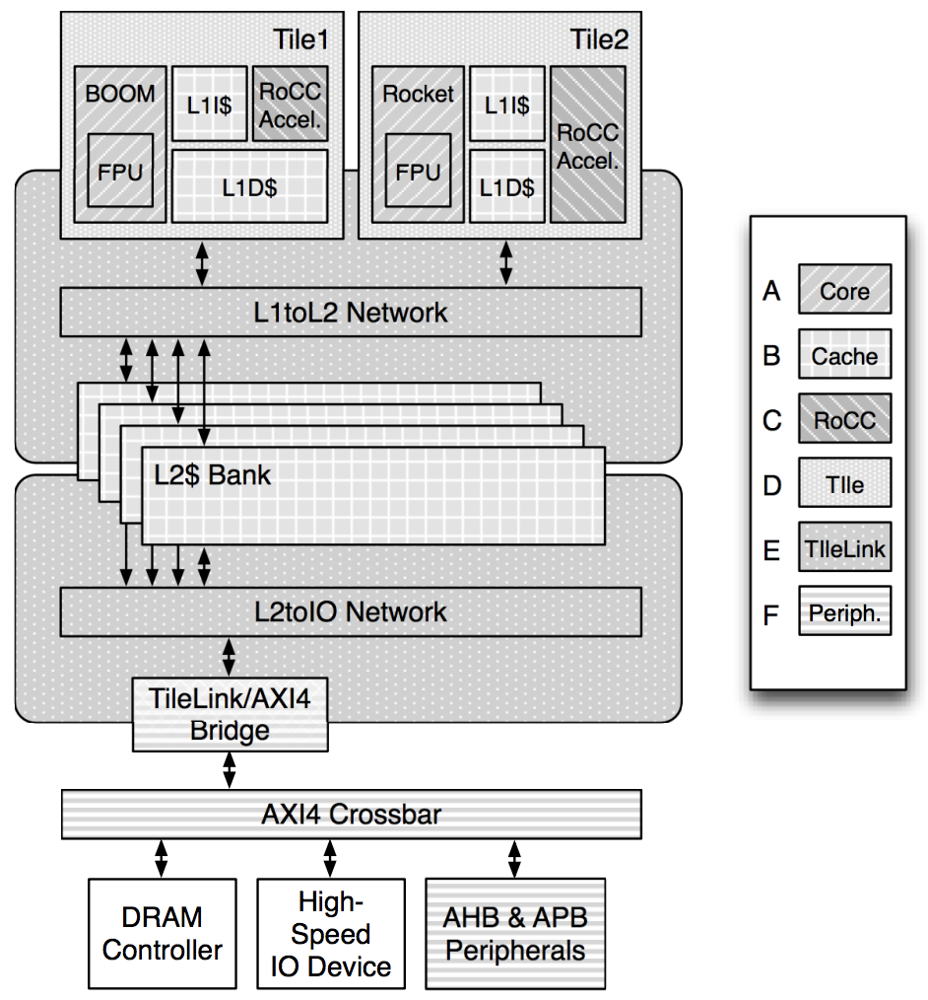
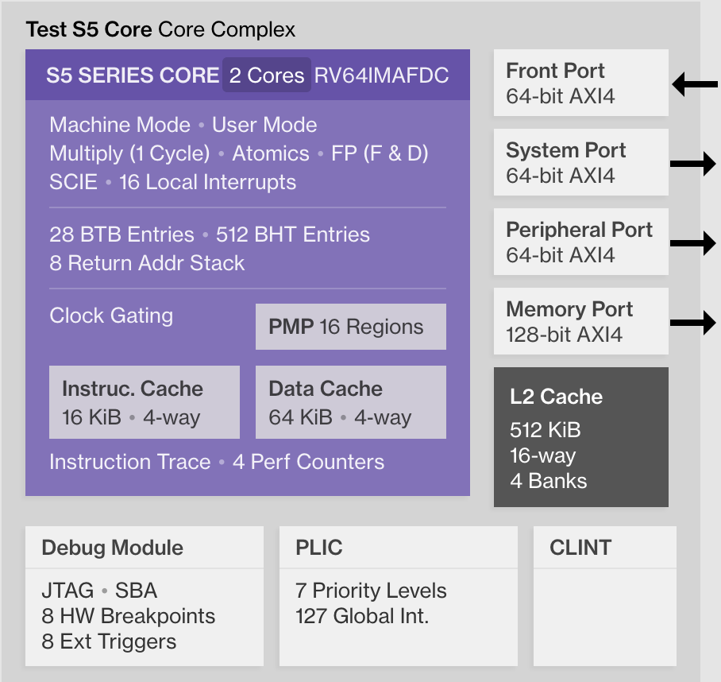

[//]:# (BEGIN title_page('Demo 4: RocketChip generator'))
title: Demo 4: RocketChip generator
class: animation-fade
layout: true

<!-- This slide will serve as the base layout for all your slides -->

.bottom-bar[
RISC-V Training - Created by Jim Wang (http://phdbreak99.github.io) - July 2019 - All rights Reserved
]

---

class: impact

## RISC-V Training

&nbsp;

# Demo 4: RocketChip generator

&nbsp;

Jim Wang (http://phdbreak99.github.io)

July 2019

[//]:# (END)

---

[//]:# (BEGIN toc_page('What is RocketChip generator', 'Generate CPU with RocketChip generator', 'CPU architecture exploration with RocketChip', 'Debug software on RocketChip with GDB', 'SiFive Core designer'))
name: toc

## Table of Content

.col-1[

&nbsp;

{{content}}

]

.col-11[

&nbsp;

### What is RocketChip generator

### Generate CPU with RocketChip generator

### CPU architecture exploration with RocketChip

### Debug software on RocketChip with GDB

### SiFive Core designer

]

[//]:# (END)

---

[//]:# (BEGIN toc)
template: toc

### >>>>
[//]:# (END)

---

## What is RocketChip generator?

.col-6[

- RISC-V **SoC** generator from UC Berekeley
- Based on Chisel
- Highly parameterized
    - Cache configs
    - Num of cores
    - Type of cores (Rocket, BOOM, w/ FPU, RoCC accelerator)
    - Num of ports (memory, system, peripheral)
]

.col-6[

]

---

## What is RocketChip generator? / setup

```shell
git clone --recursive https://github.com/chipsalliance/rocket-chip.git
export RISCV=/opt/riscv/rv64gc  # need to use matching RISC-V toolchain
export PATH=${RISCV}/bin;${PATH}
```

### Prerequisites
Because RocketChip is using Chisel (a variant of Scala, based on Java), so we need to install JDK before using RocketChip generator.

```shell
apt install -y default-jdk
```

---

## What is RocketChip generator? / Chisel

### RocketChip is written in Chisel

- Open-source hardware construction language
    - Highly parameterized generator
    - Hierarchical + object oriented + functional construction
    - Generates Verilog and C model
        - Not HLS (high-level synthesis)
- Based on Scala
    - Functional programming
    - Strong static type system
    - Compiled to Java bytecode

> If UCB had decided to use SystemVerilog + Python, RocketChip and its ECO system might be much more popular.

---

[//]:# (BEGIN toc)
template: toc

### &nbsp;

### >>>>
[//]:# (END)

---

## Generate CPU with RocketChip generator

### Compile and generate C-based emulator

```sh
cd emulator
make

ls emulator-freechips.rocketchip.system-*
```

### Compile and generator Verilog

```sh
cd vsim
make verilog

cd generated-src
ls freechips.rocketchip.system.*.v
```

> The generated Verilog is human unreadable. A huge problem in debug.

---

## Generate CPU with RocketChip generator (cont'd)

### Simulate riscv-tests with C-based emulator

```shell
make -j4 run                    # run all tests
make output/dhrystone.riscv.out # run specific test
```

### Check simulation result

```shell
# find the passed ones
grep PASSED output/*.out
# find the failed ones
grep FAILED output/*.out
```

---

[//]:# (BEGIN toc)
template: toc

### &nbsp;

### &nbsp;

### >>>>
[//]:# (END)

---

## CPU architecture exploration with RocketChip

### Two configration files

```
~/docker/riscv/rocket-chip/src/main/scala/system/Configs.scala
~/docker/riscv/rocket-chip/src/main/scala/subsystem/Configs.scala
```

### What you can change

.col-6[
-   Core
    -   32-bit or 64-bit
    -   With or without FPU
    -   With or without virtual memory
    -   With or without BTB
    -   Multiplier-divider cycles
]
.col-6[
-   L1 cache (I$ & D$)
    -   Num of sets
    -   Block size (set size)
    -   Ways
    -   Num of MSHR
    -   Num of TLB entries
-   Cross clock domain
    -   Sync or async
]

---

## CPU architecture exploration / example

### D-Cache: # of ways vs. Dhrystone performance

-   D-Cache parameters
    -   Same D$ size = 16KiB
    -   Number of ways: 16, 8, 4, 2
-   Use Dhyrstone as benchmark

-   `class DCacheParams` defined in
`~/docker/riscv/rocket-chip/src/main/scala/rocket/HellaCache.scala`

-   New classes of `WithNDCWay16Cores`, `WithNDCWay8Cores` and `WithNDCWay2Cores` in `~/docker/riscv/rocket-chip/src/main/scala/subsystem/Configs.scala`
---

## CPU architecture exploration / example (cont'd)

### D-Cache: # of ways vs. Dhrystone performance (cont'd)


| Config        | Num of ways | Microseconds for one run through Dhrystone | Dhrystones per Second |
| ------------- | ----------- | ------------------------------------------ | --------------------- |
| DCWay2Config  | 2           | x                                          | x                     |
| DefaultConfig | 4           | 483                                        | 2069                  |
| DCWay8Config  | 8           | 483                                        | 2061                  |
| DCWay16Config | 16          | 485                                        | 2060                  |

&nbsp;

#### Ways size MUST be equal or smaller than page size (4KiB)

-   To use virtual-index in cache
    -   Parallel Cache and TLB access

---

[//]:# (BEGIN toc)
template: toc

### &nbsp;

### &nbsp;

### &nbsp;

### >>>>
[//]:# (END)

---

## Debug software on RocketChip with GDB

### Generate emulator with debug feature

New config with JTAG DTM (debug transport module)

```scala
class JtagConfig extends Config(
    new WithJtagDTMSystem ++ new WithNBigCores(1) ++ new BaseConfig)
```

Generate C emulator with JTAG DTM

```shell
cd emulator
make CONFIG=JtagConfig
```

### Launch emulator

```shell
./emulator-freechips.rocketchip.system-JtagConfig +jtag_rbb_enable=1 --rbb-port=9823 hello.elf
```

---

## Debug software on RocketChip with GDB (cont'd)

### Launch OpenOCD

```
# cemulator.cfg
interface remote_bitbang
remote_bitbang_host localhost
remote_bitbang_port 9823

set _CHIPNAME riscv
jtag newtap $_CHIPNAME cpu -irlen 5

set _TARGETNAME $_CHIPNAME.cpu
target create $_TARGETNAME riscv -chain-position $_TARGETNAME

gdb_report_data_abort enable

init
halt
```

---

## Debug software on RocketChip with GDB (cont'd)

### Launch OpenOCD (cont'd)

```shell
> ${RISCV}/bin/openocd -f ./cemulator.cfg
Open On-Chip Debugger 0.10.0+dev-00112-g3c1c6e0 (2018-04-12-10:40)
Licensed under GNU GPL v2
For bug reports, read
http://openocd.org/doc/doxygen/bugs.html
Warn : Adapter driver 'remote_bitbang' did not declare which transports it allows; assuming legacy JTAG-only
Info : only one transport option; autoselect 'jtag'
Info : Initializing remote_bitbang driver
Info : Connecting to localhost:9823
Info : remote_bitbang driver initialized
Info : This adapter doesn't support configurable speed
Info : JTAG tap: riscv.cpu tap/device found: 0x00000001 (mfg: 0x000 (<invalid>), part: 0x0000, ver: 0x0)
Info : datacount=2 progbufsize=16
Info : Disabling abstract command reads from CSRs.
Info : Disabling abstract command writes to CSRs.
Info : [0] Found 1 triggers
Info : Examined RISC-V core; found 1 harts
Info :  hart 0: XLEN=64, 1 triggers
Info : Listening on port 3333 for gdb connections
Info : Listening on port 6666 for tcl connections
Info : Listening on port 4444 for telnet connections
```

---

## Debug software on RocketChip with GDB (cont'd)

### Launch GDB

```shell
> ${RISCV}/bin/riscv64-unknown-elf-gdb hello.elf
GNU gdb (GDB) 8.0.50.20170724-git
Copyright (C) 2017 Free Software Foundation, Inc.
License GPLv3+: GNU GPL version 3 or later <http://gnu.org/licenses/gpl.html>
This is free software: you are free to change and redistribute it.
There is NO WARRANTY, to the extent permitted by law.  Type "show copying"
and "show warranty" for details.
This GDB was configured as "--host=x86_64-pc-linux-gnu --target=riscv64-unknown-elf".
Type "show configuration" for configuration details.
For bug reporting instructions, please see:
<http://www.gnu.org/software/gdb/bugs/>.
Find the GDB manual and other documentation resources online at:
<http://www.gnu.org/software/gdb/documentation/>.
For help, type "help".
Type "apropos word" to search for commands related to "word"...
Reading symbols from ./proj1.out...done.
(gdb)
```

> Warning: GDB running on C emulator is super slow

---

[//]:# (BEGIN toc)
template: toc

### &nbsp;

### &nbsp;

### &nbsp;

### &nbsp;

### >>>>
[//]:# (END)

---

## SiFive Core designer

www.sifive.com



---

[//]:# (BEGIN thanks)
class: middle, center


[//]:# (END)

---

class: middle

## DIY: RocketChip architecture exploration

### Change the size of I-Cache

### Run different benchmark programs to see performance change

