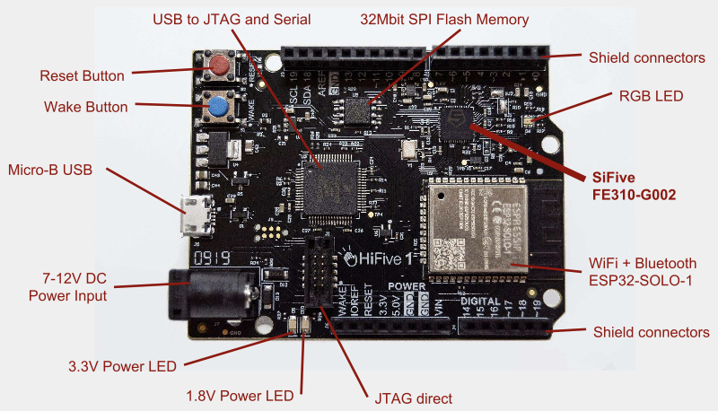

[//]:# (BEGIN title_page('Demo 5: Freedom IDE & HiFive1b board'))
title: Demo 5: Freedom IDE & HiFive1b board
class: animation-fade
layout: true

<!-- This slide will serve as the base layout for all your slides -->

.bottom-bar[
RISC-V Training - Created by Jim Wang (http://phdbreak99.github.io) - July 2019 - All rights Reserved
]

---

class: impact

## RISC-V Training

&nbsp;

# Demo 5: Freedom IDE & HiFive1b board

&nbsp;

Jim Wang (http://phdbreak99.github.io)

July 2019

[//]:# (END)

---

[//]:# (BEGIN toc_page('Freedom IDE', 'Emulate on QEMU', 'Run on HiFive1b board'))
name: toc

## Table of Content

.col-1[

&nbsp;

{{content}}

]

.col-11[

&nbsp;

### Freedom IDE

### Emulate on QEMU

### Run on HiFive1b board

]

[//]:# (END)

---

[//]:# (BEGIN toc)
template: toc

### >>>>
[//]:# (END)

---

## Freedom IDE


---

## Freedom IDE (cont'd)

### Different targets

.col-7[
| Targets                 | Comments                                          |
| ----------------------- | ------------------------------------------------- |
| qemu-sifive-e31         | QEMU emulator for 32-bit E31 CPU                  |
| qemu-sifive-s51         | QEMU emulator for 64-bit S51 CPU                  |
| freedom-e310-arty       | Arty FPGA platfrom                                |
| sifive-hifive-unleashed | SiFive's HiFive Unleased board that support Linux |
| sifive-hifive1          | SiFive's HiFive1 board                            |
| sifive-hifive1-revb     | SiFive's HiFive1-RevB board                       |
]

.col-5[

]

---

[//]:# (BEGIN toc)
template: toc

### &nbsp;

### >>>>
[//]:# (END)

---

## Emulate on QEMU

-   QEMU is a full system emulator
    -   Translate target instruction to host instruction
    -   Only functional (not trace accurate) but really fast
    -   It's good for software development, not for hardware debugging


### Demo: qemu-sifive-e31-sifive-welcome

```
QEMU emulator version 3.1.0 (SiFive QEMU 3.1.0-2019.05.1)
Copyright (c) 2003-2018 Fabrice Bellard and the QEMU Project developers


                  SIFIVE, INC.

           5555555555555555555555555
          5555                   5555
         5555                     5555
        5555                       5555
       5555       5555555555555555555555
      5555       555555555555555555555555
     5555                             5555
    5555                               5555
   5555                                 5555
  5555555555555555555555555555          55555
   55555           555555555           55555
     55555           55555           55555
       55555           5           55555
         55555                   55555
           55555               55555
             55555           55555
               55555       55555
                 55555   55555
                   555555555
                     55555
                       5


               Welcome to SiFive!

```

---

[//]:# (BEGIN toc)
template: toc

### &nbsp;

### &nbsp;

### >>>>
[//]:# (END)

---

## Run on HiFive1b board

-   HiFive1-revb board
    -   Latest HiFive1 board with FE310




### Demo: sifive-hifive1-revb-sifive-welcome

---

[//]:# (BEGIN thanks)
class: middle, center


[//]:# (END)
