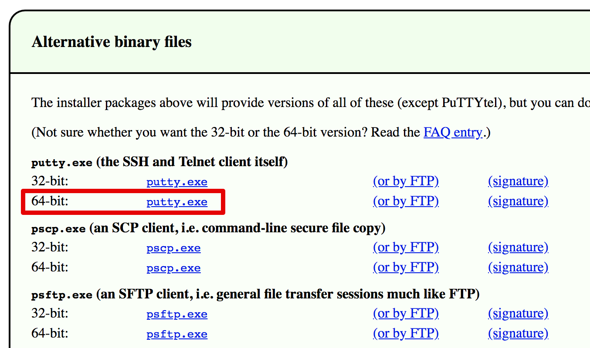

# Setup DIY env on Linode

#### 1. Go to `cn.bing.com` search `putty download`

#### 2. Click the second [*Download PuTTY: latest release (0.71)*](https://www.chiark.greenend.org.uk/~sgtatham/putty/latest.html)

#### 3. Download standalone `putty.exe` (don't need to install anything)



#### 4. Use ssh connect to IP `172.104.74.138`

This is a Linode machine I created.

```
Login: riscv
Password: riscv
```

#### 5. Go to `~/` and create your own project directory

```shell
mkdir xxx; cd xxx; cp -r ~/riscv-training .
```

#### 6. Setup RISC-V variables

```shell
export RISCV=/opt/riscv/rv64gc
export PATH=${RISCV}/bin;${PATH}
```

Check path:

```shell
> which spike
/opt/riscv/rv64gc/bin/spike
> which riscv64-unknown-elf-gcc
/opt/riscv/rv64gc/bin/riscv64-unknown-elf-gcc
```